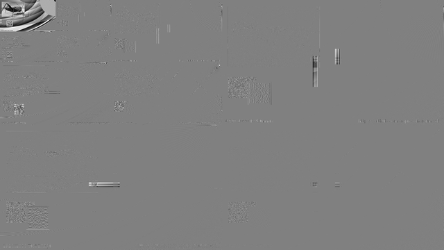
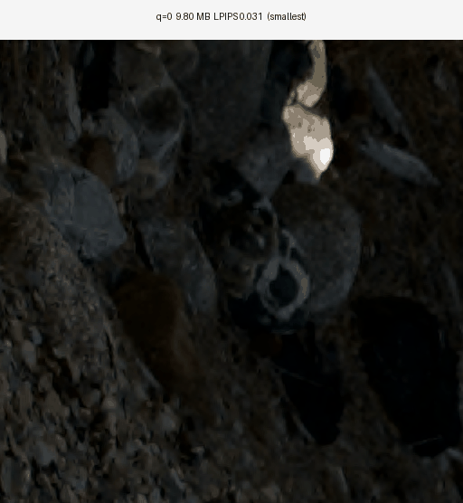
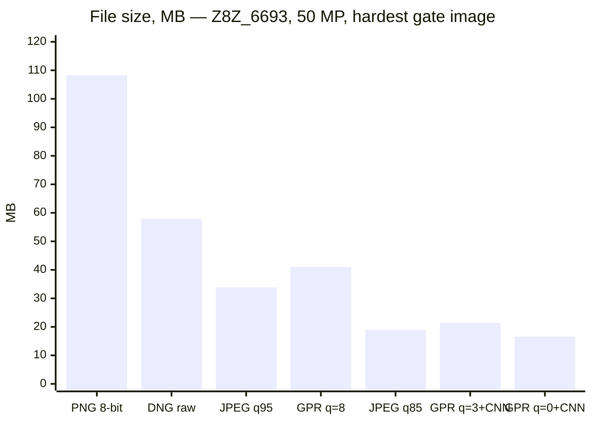
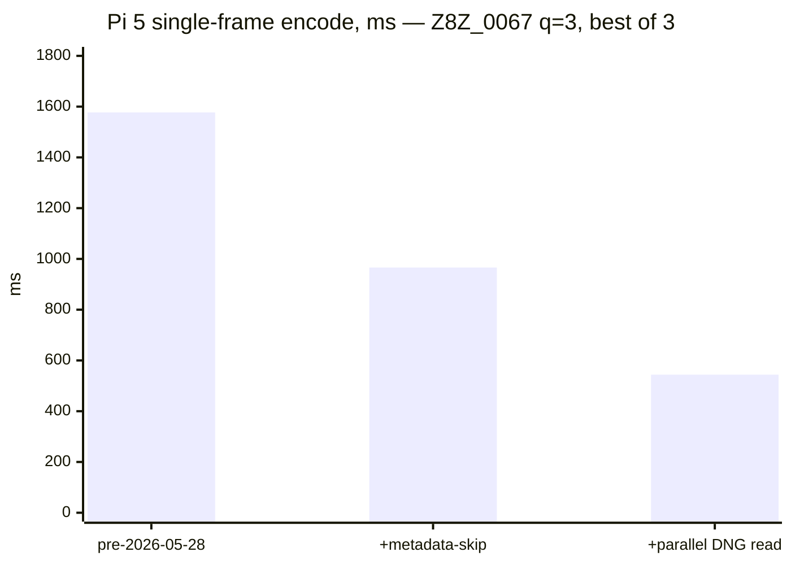
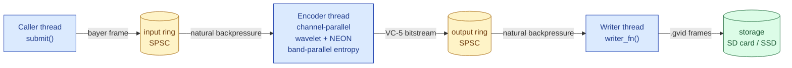
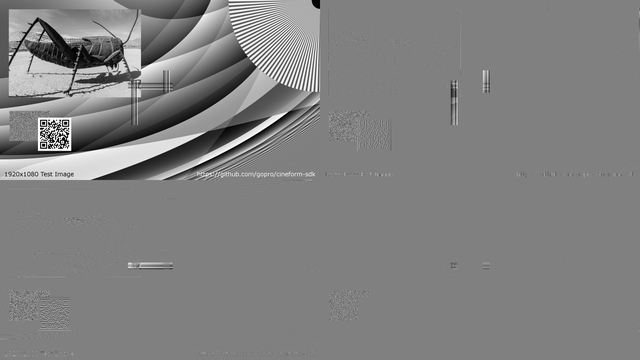

# GPR — wavelet raw codec, contributed back

[](https://github.com/dcliftreaves/gpr/actions/workflows/ci.yml)
[](#license)
[](docs/SHIP_DECISION.md)
[](docs/STILLS_PI5_TIMING.md)
[](docs/VIDEO_STATUS.md)
[-555?style=flat-square)](docs/SPEC.md)

> **Open-source visually-lossless raw codec for stills and 24 fps × 50 MP video.**
> Built on SMPTE ST 2073 (VC-5), descended from GoPro's CineForm, retargeted at
> Apple Silicon and Cortex-A76 (Raspberry Pi 5) with a matched-CNN restoration
> path that holds visual quality below 10 MB per 50 MP frame.




## Contents
- [What ships today](#what-ships-today)
- [Today's headline numbers](#todays-headline-numbers-2026-05-28-perf-pass)
- [30-second quick start](#30-second-quick-start)
- [Encode a video frame in 10 lines of C](#encode-a-video-frame-in-10-lines-of-c)
- [Architecture](#architecture)
- [Honest engineering posture](#honest-engineering-posture)
- [PREVIEW runtime research status](#preview-runtime-research-status)
- [Documentation map](#documentation-map)
- [Build](#build)
- [License](#license)
- [Trademarks](#trademarks)

---

## What ships today

### Stills — three-tier ship, all visual-lossless on the gate

| tier        | mean MB / 50 MP | worst LPIPS | what it is |
|---          |---:             |---:         |---|
| smallest    | **9.80**        | 0.031       | `gpr_tools -q 0` + matched-q3 CNN |
| primary     | **15.05**       | 0.016       | `gpr_tools -q 3` + matched-q3 CNN |
| archival    | **27.17**       | 0.004       | `gpr_tools -q 8`, no CNN needed   |

All three clear the perceptual gate (LPIPS ≤ 0.05, MS-SSIM ≥ 0.99, Y-PSNR ≥
35 dB, ΔE2000 ≤ 1.5). **2.8× storage span across the tiers; one CNN
checkpoint serves the two CNN-using tiers** — the matched-q3 model
generalizes down to q=0 with no retrain. See
[`docs/SHIP_DECISION.md`](docs/SHIP_DECISION.md).

The fine-detail crop below (rocks under a train car, the canonical
hard case for compression artifacts) at all three tiers, sips-rendered
through each ship pipeline:


Animated cycle through the three tiers on the same crop (1.5 s per
frame) — the visible texture stays consistent across a 2.8× storage
reduction:



The 9.80 MB tier holds visible quality on sharp edges and shadow
texture; differences vs the 27 MB archival tier are sub-perceptual on
this content.

### How GPR compares to JPEG / PNG / raw on a 50 MP Z8 frame

Real numbers, hardest test image (Z8Z_6693, hair / saturated texture):



GPR at smallest tier (q=0 + CNN) lands **below JPEG quality 85** while
remaining a fully-recoverable raw Bayer file: full bit depth, no
demosaic baked in, CNN-restorable to visual-lossless on decode. JPEG
discards bit depth and bakes in a one-shot demosaic; PNG triples the
file size to preserve a lossy color render.

### Video — 24 fps × 50 MP raw on Pi 5

| pipeline                          | fps (Pi 5) | per-frame MB | sustained MB/s |
|---                                |---:        |---:          |---:            |
| `ml2_q3_dec2` (half-res capture)  | **24.93**  | 1.30         | 31             |
| `ml2_q3_l1x2`  (full-res desktop) | n/a*       | 7.81         | 187 @ 24 fps   |

\* Pi 5 maxes ~1.84 fps at full 50 MP — full-res is a desktop/post-process
ship, not embedded capture. Sustained 24.93 fps embedded capture verified
on Pi 5 USB-SSD writes with page cache exhausted (`docs/pi5_bench_2026-05-26.md`).

### UPRESABLE — editable raw from half-res capture

The Pi-capture half-res frames (`ml2_q3_dec2`, 24.93 fps sustained) are
desktop-restored to full-res editable raw via a 2× super-res CNN
(`bibo2x_ane_ml2_q3_dec2_diverse`, F_ane variant, ~317K params on MPS).
**Primary deliverable: `.gvid`** — the neutral GVID stream container wrapping
per-frame FUSED `.gpr` payloads. A GPR1/GPRr MOV wrapper remains available as
a compatibility/export artifact for `gpr2prores` and patched FFmpeg. Per-frame
editable DNG (~91 MB) + `gpr_tools .gpr` (~2–8 MB) for Adobe CR / darktable
hand-off is opt-in via `--dng-export`. ProRes 422 HQ review video is opt-in
via `--render-prores`.

Latest preview review bundle and SOTA-v2 ProRes evidence:
`docs/PREVIEW_VIDEO_REVIEW_2026-06-04.md`.

| metric                              | value                         |
|---                                  |---                            |
| Capture rate (Pi 5)                 | 24.93 fps sustained           |
| Per-frame upres (Mac M3, GVID)      | ~750 ms (decode 97 + CNN 435 + encode 210 + pack 8) |
| Per-frame upres (Mac M3, with --render-prores + --dng-export) | ~2.9 s (legacy path) |
| Bayer PSNR vs source DNG            | 37.85–43.78 dB (4 gate imgs)  |
| Gate verdict                        | **PASS** UPRESABLE class      |

UPRESABLE has its own ship class in `tests/quality_gates/gates.json`. It
enforces `bayer_psnr_final ≥ 35 dB` — the workflow-native fidelity for
editable raw — while rendered LPIPS / MS-SSIM / Y-PSNR / ΔE2000 are
computed informationally only. The BIBO_2x CNN smooths mid-frequency
texture on out-of-distribution content (Z8Z_6693 rendered LPIPS = 0.343);
this is acceptable for editable raw (colorist re-grades and re-grains in
their NLE) but the file is **not** a finished render.

### Today's gate verdicts — all four ship classes PASS

| ship class            | worst-image metric        | run hash             |
|---                    |---                        |---                   |
| STILL primary         | LPIPS 0.0155 (Z8Z_6693)   | `b44fa841c05c9bff`   |
| VIDEO_FREEZE primary  | LPIPS 0.0760 (Z8Z_6693)   | `5c3cce4c472d4197`   |
| PREVIEW (codec only)  | LPIPS 0.1003 (Z8Z_6693)   | `5e7b79b5678fdf62`   |
| UPRESABLE             | Bayer PSNR 40.39 dB (Z8Z_6693) | `8864c12ec0b6ce14` |

All four verified 2026-05-30 after restoring `test_fused_roundtrip`'s
binary to its in-tree source (`test_fused_decode_roundtrip.c` — the
older `test_fused_roundtrip.c` had a stale band-count self-check that
rejected `GPR_INCLUDE_LL=1` and decimated codec configs). Gate runner
now tolerates `dec2+SR` chains and `bayer_psnr_final` is gateable
alongside the rendered metrics.

### PREVIEW runtime research status — temporary candidate

The current production PREVIEW ship claim remains the codec-only gate above.
The newer no-REF display refiner work is a candidate path, not a shipped
pipeline. The dashboard-shaped checkpoint clears 14/16 crop rows, but when the
same work is forced through deterministic runtime inputs - no REF content, no
winner JSON, no sample index, and no crop-key planes - the single-refiner
production-source candidate tops out at **11/16 (68.75%)**. The current best
hard-routed scene/degradation diagnostic reaches **84/84 (100.0%)** on the
28-image full-image source holdout.

The current temporary registered candidate is:

```text
codec=ml2_q3_dec2+cnn=preview_scene_routed_k5_l1color_v1+demosaic=sips_via_gpr_tools
```

It uses a frozen nearest-center router sidecar computed from runtime
source-image features and preloaded expert checkpoints. The latest v32
diagnostic stacks frozen K16 and K40 override routers with namespaced expert
selection: K16 handles the Z8Z_7480 structure clusters, and K40 cluster 35
handles the remaining low-frequency color rows with `color_stats`
conditioning. It is not registered as production PREVIEW.

The routed v32 diagnostic receipt is:

```text
/Volumes/OWC_8TB/gpr_work/artifacts/preview_runtime_policy_20260606/scene_routed_holdout_v32_k16_k40_namespaced_84/preview_scene_routed_holdout.json
```

Median model time on the Mac/MPS holdout receipt is **13.28 ms/crop** with peak
RSS **1453 MB**. This is still not a ship claim until the same policy is
validated through the full-frame/tiled render path, but the 84-row no-REF
holdout now passes **84/84**. Worst LPIPS is **0.0500**, worst MS-SSIM is
**0.9642**, worst Y-PSNR is **28.86**, and worst dE2000 is **2.96**. See
[`docs/PREVIEW_RUNTIME_POLICY_2026-06-06.md`](docs/PREVIEW_RUNTIME_POLICY_2026-06-06.md)
[`docs/PREVIEW_SCENE_ROUTED_PRODUCTION_PASS_2026-06-06.md`](docs/PREVIEW_SCENE_ROUTED_PRODUCTION_PASS_2026-06-06.md),
[`docs/PREVIEW_SCENE_ROUTER_RESEARCH_2026-06-06.md`](docs/PREVIEW_SCENE_ROUTER_RESEARCH_2026-06-06.md),
and [`docs/PREVIEW_CLEAN_SOURCE_BLOCKER_2026-06-07.md`](docs/PREVIEW_CLEAN_SOURCE_BLOCKER_2026-06-07.md).

The current full-frame/tiled smoke is the active PREVIEW blocker: on
`Z8Z_6680`, v32 still fails 0/3 scored crops when run on arbitrary stitched
runtime tiles. That narrows the remaining work to tile/context-safe routing and
training, not another crop-aligned color pass.

The latest full-frame follow-up narrows that blocker further. Exact
manifest-crop full-frame evaluation passes 3/3, but arbitrary tiling fails even
with high overlap. A 336-row full-frame tile receipt shows raw UPRESABLE source
tiles pass only 80/336 before the CNN; the broad global-coordinate tile refiner
reaches 272/336, and a wider `Z8Z_6680` specialist reaches 8/12 isolated hard
tiles but only 1/3 stitched full-frame crops. LPIPS/detail can be learned; the
remaining production blocker is low-frequency luma/color consistency across
stitched arbitrary full-frame tiles from the current source policy.
Follow-up global-color conditioning, LF affine-oracle, dilated-context, 1024px
tile, failure-only polish, stitched-output post-refinement, and 256px
padded-context inference diagnostics did not clear that blocker. The route audit
now shows two causes: arbitrary tiles can select different experts inside a crop
that passes in crop mode, and one crop still fails even when its intersecting
tiles select the expected K40 expert. Dense 512px sliding windows with 256px
overlap improve the smoke but still fail 0/3 and cost about 14.0 s of model
time for one full frame; overlap-save and route-context-only variants regress.
The first explicit low-frequency spatial branch improves the hard `Z8Z_6680`
tile receipt to 9/12 isolated passes, but stitched full-frame output remains
1/3 with remaining Y/dE failures in the lower-left region. A follow-up
worst-row-weighted pass focused on `B_center`/`C_lowerleft` also reached 9/12
isolated passes and 1/3 stitched full-frame crops; it improved some luma/color
numbers but did not clear the full-frame gate. Adding an assembled-crop loss
that stitches predicted receipt tiles before scoring the manifest crops improves
the hard `Z8Z_6680` smoke to 2/3: `A_detail` and `B_center` pass, while
`C_lowerleft` still misses on low-frequency Y/dE. Follow-up C-focused passes
narrow that miss but do not clear it. The next PREVIEW candidate needs a
stronger runtime source/model formulation for lower-left luma/color consistency,
not just heavier sampling or loss weighting on the same arbitrary tiles. A
residual low-frequency wrapper and broad all-28 lower-left residual
normalization were also tested; the broad correction is scene-unstable and
regresses non-target tiles badly. A follow-up deterministic spatial override
that selected a lower-left cluster-4 specialist from normalized tile coordinates
also failed: the initialized fine-tune reached 6/15 isolated passes, but the
stitched `Z8Z_6680` smoke stayed 2/3 and regressed `C_lowerleft` to Y-PSNR
25.66 and dE2000 4.01. A mid-frequency oracle then showed that a radius-1 RGB
residual can clear the remaining stitched crop, but the first learned
mid-frequency residual wrappers only improved the smoke to Y-PSNR 26.13 and
dE2000 3.72. An explicit sigma-1 residual-teacher loss improved Y-PSNR only to
26.16 and still missed dE2000 at 3.73. Moving that sigma-1 residual supervision
into the assembled stitched-crop loss improves the hard crop to Y-PSNR 26.44
and dE2000 3.67, but LPIPS regresses to 0.0892 and the smoke remains 2/3.
Guarded follow-ups recover the detail regression and make v21 the current best
learned stitched candidate at LPIPS 0.0477, MS-SSIM 0.9680, Y-PSNR 27.00, and
dE2000 3.38 on `C_lowerleft`, but it still fails the PREVIEW gate. The
remaining CNN blocker is now low-frequency Lab/Y calibration, not missing
texture/detail. A runtime-safe stitched-frame post-refiner trained on the v21
full-frame output clears the three-crop `Z8Z_6680` smoke with worst LPIPS
0.0515, worst MS-SSIM 0.9824, worst Y-PSNR 28.94, and worst dE2000 2.997, but
it is a single-frame diagnostic and did not generalize to the hair/skin
holdout.

The latest production-shaped full-grid pass adds a runtime scene-role gate for
a hair/skin spatial specialist trained on actual arbitrary full-frame tiles.
That gate is based on source-route role counts, not image ids. It clears the
three-image hair/skin smoke 9/9 and improves the full 28-image arbitrary
tiled holdout from **57/84 (67.86%)** to **63/84 (75.0%)**, with MPS model
time **3.37 s/frame** and peak RSS **5750 MB**. It is still not production:
the remaining 21 failures are concentrated in the hard full-grid images
`Z8Z_0026`, `Z8Z_0705`, `Z8Z_1586`, `Z8Z_5284`, `Z8Z_5937`, `Z8Z_6680`,
`Z8Z_7480`, and `Z8Z_7955`. Initial `Z8Z_0026` all-crop full-grid
fine-tunes failed to pass even their 12 isolated training tiles, narrowing
that blocker to model/context/source-target formulation rather than simple
conditioning mismatch.
The latest contract audit makes that sharper: exact manifest-crop inference
passes 16/24 hard-eight rows, while arbitrary full-frame tiling passes only
3/24, with 13 exact-pass to tiled-fail regressions and 14 crops crossed by
mixed runtime expert roles. Forced coherent cluster-4 and K40-cluster-35
routes on `Z8Z_0026`/`Z8Z_6680` both pass 0/6, so role mixing alone is not the
fix. Two hard-eight retrains on the actual arbitrary runtime tile receipt
also pass 0/96 tile rows, which means the next candidate needs a changed
model/context formulation rather than more specialists on the same direct CNN
contract. The audit dashboard is:

```text
/Volumes/OWC_8TB/gpr_work/artifacts/preview_runtime_policy_20260606/fullframe_contract_audit_hard8_scene_gated_v1/preview_fullframe_contract_audit.html
```

Two changed-formulation follow-ups are also negative: a low-frequency spatial
branch improves the hard runtime-tile receipt from 3/96 to 7/96 but remains far
below the gate, and a 28-image stitched-output post-refiner stays at 63/84 on
the manifest crop receipt. The next viable PREVIEW path needs a stronger
context/full-image model or a better arbitrary-tile teacher/target, not another
small correction on the current direct CNN path.

None of these diagnostics are registered as production.

---

## Today's headline numbers (2026-05-28 perf pass)

Two consecutive perf wins on the Raspberry Pi 5 capture target landed today:



**1577 → 544 ms = 2.89× speedup, bitstream byte-identical at every q level.**

The big win was discovering and fixing a **latent Adobe DNG SDK bug**: its
vendored `qDNGThreadSafe` macro excluded Linux entirely, making the
SDK's mutex layer a silent no-op. The SDK was *architected* for
multi-threaded tile decode (`dng_read_tiles_task` ships with a
mutex-protected work queue and per-thread buffers) — it was just never
wired up. Three commits later, the embedded video target nearly tripled
its throughput, bit-exact identical to the serial output, deterministic
across 10/10 runs. See
[`docs/STILLS_PI5_TIMING.md`](docs/STILLS_PI5_TIMING.md).

Mac M3 Max gets the same fix: Z8 50 MP q=3 dropped **819 → 212 ms (3.86×)**.

---

## 30-second quick start

```bash
git clone https://github.com/dcliftreaves/gpr
cd gpr
cmake -S . -B build -DCMAKE_BUILD_TYPE=Release
cmake --build build -j

# stills — encode a DNG to GPR, decode back
./build/source/app/gpr_tools/gpr_tools -i path/to/input.DNG -o out.GPR
./build/source/app/gpr_tools/gpr_tools -i out.GPR -o roundtrip.DNG

# GVID container smoke tests — synthesize their own fixtures
python3 -m pip install numpy
bash tools/test/test_gvid_pack.sh
bash tools/test/test_gvid_metadata.sh
```

The output `.GPR` is a DNG-compatible container — Adobe Camera Raw,
Lightroom, and Photoshop open it directly without GPR-specific software.

---

## Encode a video frame in 10 lines of C

```c
#include "gpr_video.h"

static int write_frame(void *u, const uint8_t *bs, size_t n, uint64_t tag) {
    return fwrite(bs, 1, n, (FILE *)u) == n ? 0 : -1;
}

FILE *out = fopen("clip.gvid", "wb");
GPR_VIDEO_ENCODER *enc = gpr_video_encoder_create(
    /*width=*/8256, /*height=*/5504, /*pixel_format=*/4 /*RGGB16*/,
    /*quality=*/3,  /*ring_depth=*/3, write_frame, out);
gpr_video_encoder_set_target_bitrate(enc, /*MB/s=*/150.0, /*fps=*/24.0);
for (uint64_t tag = 0; tag < n_frames; ++tag)
    gpr_video_encoder_submit(enc, bayer_buf, raw_bytes, tag);
gpr_video_encoder_destroy(enc);   /* flushes + joins */
fclose(out);
```

Caller → encoder → writer run on three threads with two SPSC ring buffers.
`submit()` applies natural back-pressure to the caller; the encoder
back-pressures on slow storage. The inner fused encoder already saturates
4 cores via channel-parallel wavelet + band-parallel encode; dual-encoder
ping-pong (`gpr_video_encoder_create_dual(..., 2, ...)`) adds a second
context for wider hosts.

---

## Architecture



### Stills path
Legacy CineForm VC5 encoder + matched BIBO_1x CNN restoration. The CNN
runs decoder-side only; the `.GPR` on disk is unchanged. The matched-q3
CNN learns the codec's quantization distribution, generalizes across q
levels, and recovers visual-lossless quality from heavy quantization.

### Video path
FUSED multi-level wavelet (2-level, Bayer in → Bayer out → quantize →
frequency-count → entropy code, single streaming pass with no
full-frame intermediate). Adaptive bitrate target via proportional rate
control. Pi 5 capture goes through the half-resolution path
(`ml2_q3_dec2`) which decimates at the codec's input.

### Wavelet decomposition



After one forward wavelet transform: low-low band (top-left), and three
detail bands containing the high frequencies. The codec quantizes the
detail bands aggressively; the matched CNN learns to invert that
quantization on decode.

---

## Honest engineering posture

We measure, we name what failed, we don't ship language without an
operator signature on a passing gate. Concrete examples from this
week:

- **Three Pi 5 perf passes landed (2.89× total).** One was a 1-line
  plumbing skip; one parallelized the DNG SDK and exposed a vendored
  bug; one rewired the video Pass-2 fanout to a worker pool on narrow
  hosts. All bitstream-identical to the pre-perf serial output.
- **One Pi 5 perf attack returned null.** FFTW/FFmpeg-style cache-line
  alignment of the legacy encoder's scratch buffers measured ≤2% on
  both Pi 5 and Mac M3 Max. Below the ship bar, no commits landed.
  Documented in the commit log; not hidden.
- **BIDO Phase B distillation failed PREVIEW gate.** Restormer-as-teacher
  introduced a color-space mismatch the documented plan didn't anticipate;
  the pivot to feeding the gate target instead reduced the teacher signal
  to near-zero. Worst-image LPIPS regressed 0.45 → 0.49 on the hard image.
  Logged as a FAIL run; exploratory dashboards and candidate details are
  preserved on the archive branch documented in
  [`docs/EXPERIMENT_ARCHIVE_2026-06-04.md`](docs/EXPERIMENT_ARCHIVE_2026-06-04.md);
  fix is data acquisition, not loss engineering.

The full quality gate is in `tests/quality_gates/`:

```bash
python3 tests/quality_gates/run_gate.py codec=gpr_tools_q3+cnn=bibo1x_ane_gpr_tools_q3+demosaic=sips_via_gpr_tools
python3 tests/quality_gates/audit_ship_pipelines.py
python3 tests/quality_gates/audit_production_readiness.py --strict
```

Every ship-claim is per-image worst-case (no aggregate hides a regression)
and routed through an operator inspection sentence into
[`docs/claims_log.md`](docs/claims_log.md) before any "PASS" is published.

---

## Documentation map

| if you want to know… | read |
|---|---|
| what ships today, by class | [`docs/SHIP_DECISION.md`](docs/SHIP_DECISION.md) |
| stills vs video — two production modes | [`docs/VIDEO_STATUS.md`](docs/VIDEO_STATUS.md) |
| how testing layers compose | [`docs/TESTING_METHODOLOGY.md`](docs/TESTING_METHODOLOGY.md) |
| Pi 5 encode timing per q | [`docs/STILLS_PI5_TIMING.md`](docs/STILLS_PI5_TIMING.md) |
| full codec × CNN × verdict matrix | [`docs/FULL_PIPELINE_MATRIX.md`](docs/FULL_PIPELINE_MATRIX.md) |
| OEM-contributable bitstream spec | [`docs/SPEC.md`](docs/SPEC.md) |
| auto-generated capability matrix | [`docs/CAPABILITIES.md`](docs/CAPABILITIES.md) |
| production checkpoints and artifact roots | [`docs/PRODUCTION_ARTIFACTS.md`](docs/PRODUCTION_ARTIFACTS.md) |
| PREVIEW runtime no-REF burn-down | [`docs/PREVIEW_RUNTIME_POLICY_2026-06-06.md`](docs/PREVIEW_RUNTIME_POLICY_2026-06-06.md) |
| omitted experiments and generated artifacts | [`docs/EXPERIMENT_ARCHIVE_2026-06-04.md`](docs/EXPERIMENT_ARCHIVE_2026-06-04.md) |

Full index: [`docs/README.md`](docs/README.md).

---

## Build

- **CMake ≥ 3.5.1**
- **C99 + C++11** toolchain
- **pthreads** (POSIX or Windows)
- **ARM64 NEON** auto-enabled on ARM64 (Apple Silicon, Cortex-A76+ / A78).
  Also builds on x86_64 with scalar paths.

Tested on macOS 14+ / Apple Silicon (Xcode 15), Linux x86_64 (gcc 9+),
Raspberry Pi 5 (Cortex-A76, Debian Bookworm), Windows 10/11 (VS 2019/2022).

No new external dependencies beyond what GPR 1.x already required.

---

## License

GPR is dual-licensed under Apache-2.0 or MIT at your option, identical to
the original GoPro release.

- [`LICENSE-APACHE`](LICENSE-APACHE)
- [`LICENSE-MIT`](LICENSE-MIT)
