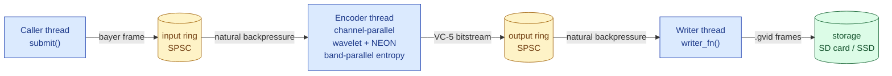

# GPR — wavelet raw codec, contributed back

[](https://github.com/dcliftreaves/gpr/actions/workflows/ci.yml)
[](#license)
[](docs/SHIP_DECISION.md)
[](docs/STILLS_PI5_TIMING.md)
[](docs/VIDEO_STATUS.md)
[-555?style=flat-square)](docs/SPEC.md)

> **Open-source visually-lossless raw codec for stills and 24 fps × 50 MP video.**
> Built on SMPTE ST 2073 (VC-5), descended from GoPro's CineForm, retargeted at
> Apple Silicon and Cortex-A76 (Raspberry Pi 5) with a matched-CNN restoration
> path that holds visual quality below 10 MB per 50 MP frame.


## Contents
- [What ships today](#what-ships-today)
- [Today's headline numbers](#todays-headline-numbers-2026-05-28-perf-pass)
- [30-second quick start](#30-second-quick-start)
- [Encode a video frame in 10 lines of C](#encode-a-video-frame-in-10-lines-of-c)
- [Architecture](#architecture)
- [Honest engineering posture](#honest-engineering-posture)
- [Documentation map](#documentation-map)
- [Build](#build)
- [License](#license)
- [Trademarks](#trademarks)

---

## What ships today

### Stills — three-tier ship, all visual-lossless on the gate

| tier        | mean MB / 50 MP | worst LPIPS | what it is |
|---          |---:             |---:         |---|
| smallest    | **9.80**        | 0.031       | `gpr_tools -q 0` + matched-q3 CNN |
| primary     | **15.05**       | 0.016       | `gpr_tools -q 3` + matched-q3 CNN |
| archival    | **27.17**       | 0.004       | `gpr_tools -q 8`, no CNN needed   |

All three clear the perceptual gate (LPIPS ≤ 0.05, MS-SSIM ≥ 0.99, Y-PSNR ≥
35 dB, ΔE2000 ≤ 1.5). **2.8× storage span across the tiers; one CNN
checkpoint serves the two CNN-using tiers** — the matched-q3 model
generalizes down to q=0 with no retrain. See
[`docs/SHIP_DECISION.md`](docs/SHIP_DECISION.md).

The fine-detail crop below (rocks under a train car, the canonical
hard case for compression artifacts) at all three tiers, sips-rendered
through each ship pipeline:


The 9.80 MB tier holds visible quality on sharp edges and shadow
texture; differences vs the 27 MB archival tier are sub-perceptual on
this content.

### Video — 24 fps × 50 MP raw on Pi 5

| pipeline                          | fps (Pi 5) | per-frame MB | sustained MB/s |
|---                                |---:        |---:          |---:            |
| `ml2_q3_dec2` (half-res capture)  | **24.93**  | 1.30         | 31             |
| `ml2_q3_l1x2`  (full-res desktop) | n/a*       | 7.81         | 187 @ 24 fps   |

\* Pi 5 maxes ~1.84 fps at full 50 MP — full-res is a desktop/post-process
ship, not embedded capture. Sustained 24.93 fps embedded capture verified
on Pi 5 USB-SSD writes with page cache exhausted (`docs/pi5_bench_2026-05-26.md`).

---

## Today's headline numbers (2026-05-28 perf pass)

Two consecutive perf wins on the Raspberry Pi 5 capture target landed today:

```
                                Z8Z_0067 q=3, best of 3 wall clock
  baseline (pre-2026-05-28):          1577 ms     0.57 fps
   + metadata-skip plumbing:           966 ms     1.04 fps     (38% off)
   + parallel DNG SDK tile read:       544 ms     1.84 fps     (43% more)
                                       ──────
                                  2.89× speedup, bitstream byte-identical
```

The big win was discovering and fixing a **latent Adobe DNG SDK bug**: its
vendored `qDNGThreadSafe` macro excluded Linux entirely, making the
SDK's mutex layer a silent no-op. The SDK was *architected* for
multi-threaded tile decode (`dng_read_tiles_task` ships with a
mutex-protected work queue and per-thread buffers) — it was just never
wired up. Three commits later, the embedded video target nearly tripled
its throughput, bit-exact identical to the serial output, deterministic
across 10/10 runs. See
[`docs/STILLS_PI5_TIMING.md`](docs/STILLS_PI5_TIMING.md).

Mac M3 Max gets the same fix: Z8 50 MP q=3 dropped **819 → 212 ms (3.86×)**.

---

## 30-second quick start

```bash
git clone https://github.com/dcliftreaves/gpr
cd gpr && mkdir build && cd build && cmake .. && make

# stills — encode a DNG to GPR, decode back
./source/app/gpr_tools/gpr_tools -i ../data/samples/input.DNG -o out.GPR
./source/app/gpr_tools/gpr_tools -i out.GPR -o roundtrip.DNG

# video — full-chain integration test
./source/app/test_video_full_chain
```

The output `.GPR` is a DNG-compatible container — Adobe Camera Raw,
Lightroom, and Photoshop open it directly without GPR-specific software.

---

## Encode a video frame in 10 lines of C

```c
#include "gpr_video.h"

static int write_frame(void *u, const uint8_t *bs, size_t n, uint64_t tag) {
    return fwrite(bs, 1, n, (FILE *)u) == n ? 0 : -1;
}

FILE *out = fopen("clip.gvid", "wb");
GPR_VIDEO_ENCODER *enc = gpr_video_encoder_create(
    /*width=*/8256, /*height=*/5504, /*pixel_format=*/4 /*RGGB16*/,
    /*quality=*/3,  /*ring_depth=*/3, write_frame, out);
gpr_video_encoder_set_target_bitrate(enc, /*MB/s=*/150.0, /*fps=*/24.0);
for (uint64_t tag = 0; tag < n_frames; ++tag)
    gpr_video_encoder_submit(enc, bayer_buf, raw_bytes, tag);
gpr_video_encoder_destroy(enc);   /* flushes + joins */
fclose(out);
```

Caller → encoder → writer run on three threads with two SPSC ring buffers.
`submit()` applies natural back-pressure to the caller; the encoder
back-pressures on slow storage. The inner fused encoder already saturates
4 cores via channel-parallel wavelet + band-parallel encode; dual-encoder
ping-pong (`gpr_video_encoder_create_dual(..., 2, ...)`) adds a second
context for wider hosts.

---

## Architecture



### Stills path
Legacy CineForm VC5 encoder + matched BIBO_1x CNN restoration. The CNN
runs decoder-side only; the `.GPR` on disk is unchanged. The matched-q3
CNN learns the codec's quantization distribution, generalizes across q
levels, and recovers visual-lossless quality from heavy quantization.

### Video path
FUSED multi-level wavelet (2-level, Bayer in → Bayer out → quantize →
frequency-count → entropy code, single streaming pass with no
full-frame intermediate). Adaptive bitrate target via proportional rate
control. Pi 5 capture goes through the half-resolution path
(`ml2_q3_dec2`) which decimates at the codec's input.

### Wavelet decomposition


After one forward wavelet transform: low-low band (top-left), and three
detail bands containing the high frequencies. The codec quantizes the
detail bands aggressively; the matched CNN learns to invert that
quantization on decode.

---

## Honest engineering posture

We measure, we name what failed, we don't ship language without an
operator signature on a passing gate. Concrete examples from this
week:

- **Three Pi 5 perf passes landed (2.89× total).** One was a 1-line
  plumbing skip; one parallelized the DNG SDK and exposed a vendored
  bug; one rewired the video Pass-2 fanout to a worker pool on narrow
  hosts. All bitstream-identical to the pre-perf serial output.
- **One Pi 5 perf attack returned null.** FFTW/FFmpeg-style cache-line
  alignment of the legacy encoder's scratch buffers measured ≤2% on
  both Pi 5 and Mac M3 Max. Below the ship bar, no commits landed.
  Documented in the commit log; not hidden.
- **BIDO Phase B distillation failed PREVIEW gate.** Restormer-as-teacher
  introduced a color-space mismatch the documented plan didn't anticipate;
  the pivot to feeding the gate target instead reduced the teacher signal
  to near-zero. Worst-image LPIPS regressed 0.45 → 0.49 on the hard image.
  Logged as a FAIL run; diagnosis written up
  ([`docs/CORPUS_EXPANSION_PLAN.md`](docs/CORPUS_EXPANSION_PLAN.md));
  fix is data acquisition, not loss engineering.

The full quality gate is in `tests/quality_gates/`:

```bash
python3 tests/quality_gates/run_gate.py codec=gpr_tools_q3+cnn=bibo1x_ane_gpr_tools_q3+demosaic=sips_via_gpr_tools
python3 tests/quality_gates/audit_ship_pipelines.py
```

Every ship-claim is per-image worst-case (no aggregate hides a regression)
and routed through an operator inspection sentence into
[`docs/claims_log.md`](docs/claims_log.md) before any "PASS" is published.

---

## Documentation map

| if you want to know… | read |
|---|---|
| what ships today, by class | [`docs/SHIP_DECISION.md`](docs/SHIP_DECISION.md) |
| stills vs video — two production modes | [`docs/VIDEO_STATUS.md`](docs/VIDEO_STATUS.md) |
| how testing layers compose | [`docs/TESTING_METHODOLOGY.md`](docs/TESTING_METHODOLOGY.md) |
| Pi 5 encode timing per q | [`docs/STILLS_PI5_TIMING.md`](docs/STILLS_PI5_TIMING.md) |
| full codec × CNN × verdict matrix | [`docs/FULL_PIPELINE_MATRIX.md`](docs/FULL_PIPELINE_MATRIX.md) |
| OEM-contributable bitstream spec | [`docs/SPEC.md`](docs/SPEC.md) |
| auto-generated capability matrix | [`docs/CAPABILITIES.md`](docs/CAPABILITIES.md) |

Full index: [`docs/README.md`](docs/README.md).

---

## Build

- **CMake ≥ 3.5.1**
- **C99 + C++11** toolchain
- **pthreads** (POSIX or Windows)
- **ARM64 NEON** auto-enabled on ARM64 (Apple Silicon, Cortex-A76+ / A78).
  Also builds on x86_64 with scalar paths.

Tested on macOS 14+ / Apple Silicon (Xcode 15), Linux x86_64 (gcc 9+),
Raspberry Pi 5 (Cortex-A76, Debian Bookworm), Windows 10/11 (VS 2019/2022).

No new external dependencies beyond what GPR 1.x already required.

---

## License

GPR is dual-licensed under Apache-2.0 or MIT at your option, identical to
the original GoPro release.

- [`LICENSE-APACHE`](LICENSE-APACHE)
- [`LICENSE-MIT`](LICENSE-MIT)

