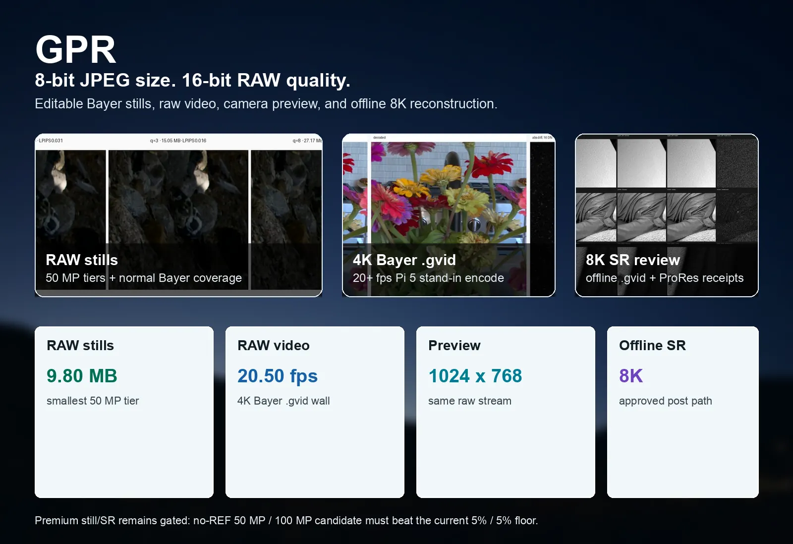
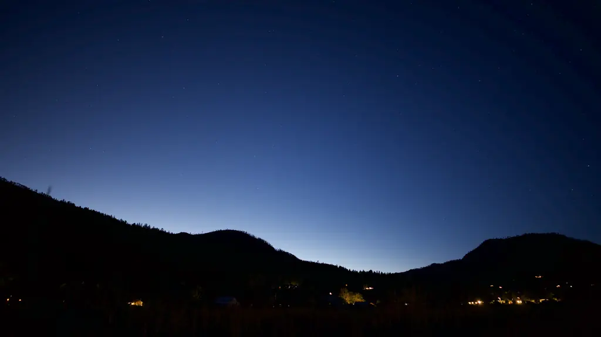
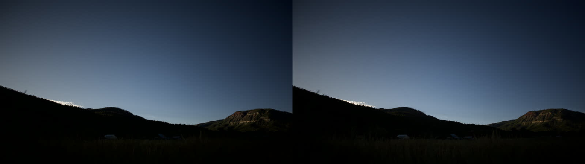
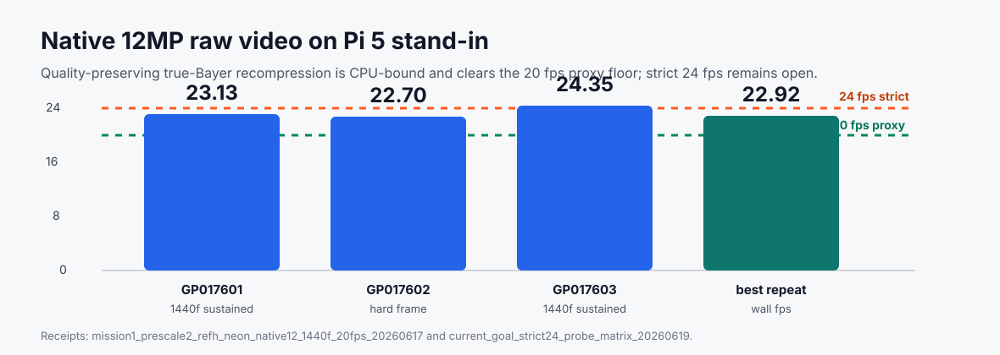
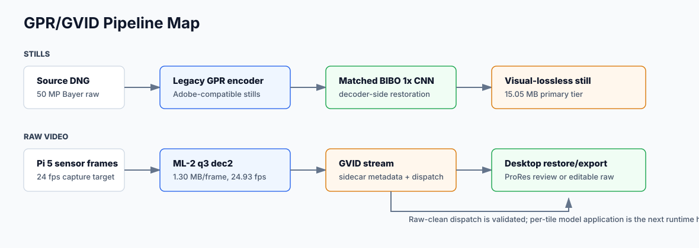
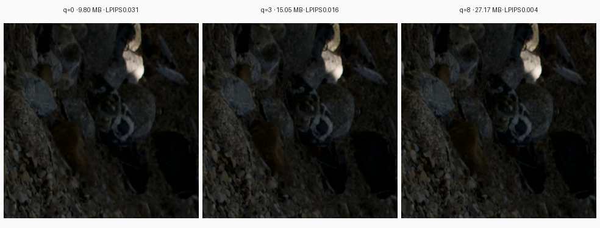
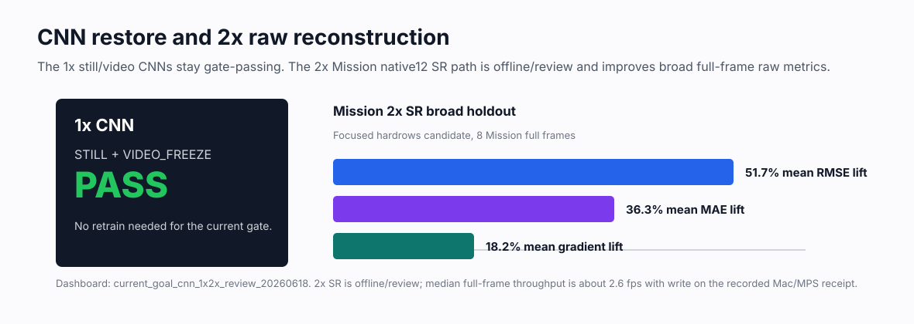
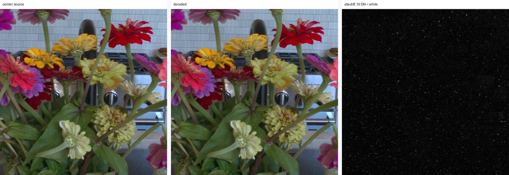
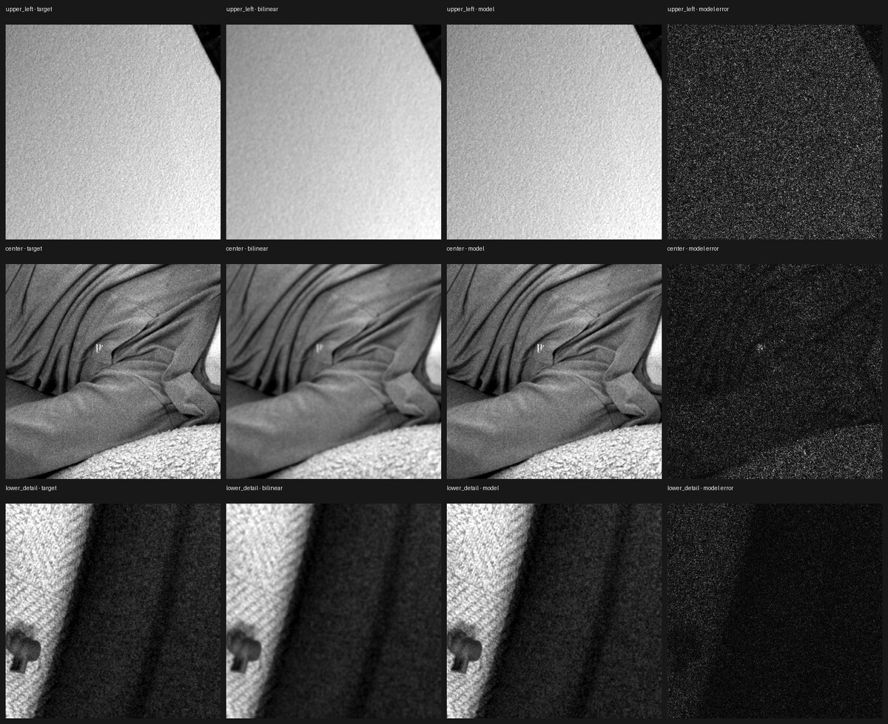
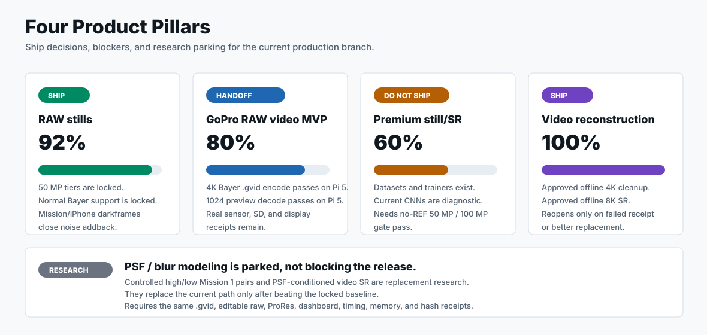

# GPR

[](https://github.com/dcliftreaves/gpr/actions/workflows/ci.yml)
[](#license)
[](docs/SHIP_DECISION.md)
[](docs/VIDEO_STATUS.md)
[](docs/VIDEO_STATUS.md)
[-555?style=flat-square)](docs/SPEC.md)

## Open Raw Video For Action Cameras

**8-bit JPEG size. 16-bit RAW quality. Editable Bayer video.**

GPR is an open raw Bayer media suite for stills, camera-class raw video,
camera-back preview, offline reconstruction, and review renders. It is the
prototype path for GoPro-class raw video: sensor Bayer frames go into compact
`.gvid` streams, the same stream drives a camera-back preview, desktop tools
restore 4K/8K detail with decoder-side CNNs, and ProRes review media can be
exported without replacing the editable raw source.



| capture | camera preview | detail restore | review/export |
|---|---|---|---|
| 4096 x 3072 Bayer into `.gvid`, above the active 20 fps Pi 5 stand-in floor | 1024 x 768 full-frame preview from the same 4K `.gvid`, above 20 fps | 4K cleanup and offline 8K SR from raw Bayer sources | 4K and 8K ProRes review outputs from `.gvid` receipts |

| headline result | current proof |
|---|---|
| **8-bit JPEG size, 16-bit RAW quality** | 50 MP editable still tiers average **9.80 MB**, **15.05 MB**, and **27.17 MB** while passing the committed visual gate. |
| **True raw-video MVP** | 4096 x 3072 Bayer frames recompress into `.gvid` above the accepted **20 fps** Pi 5 stand-in floor; camera-role Mission 1 receipts remain the production handoff. |
| **Same stream, live preview** | The 4K `.gvid` decodes to full-frame 1024 x 768 preview above **20 fps** on the Pi 5 stand-in. |
| **Offline 8K reconstruction** | Separate standalone 8K scene videos exist for no-CNN and CNN paths on Z8 and Mission 1 evidence sets, plus `.gvid` and ProRes receipts. |

The current evidence covers the raw-video prototype loop end to end: true Bayer
recompression into `.gvid`, camera-back preview decode from that stream, 4K
cleanup, offline 8K SR, editable DNG/GPR packaging, ProRes review, and release
receipts. For the Mission 1 raw-video loop, the remaining production step is
intentionally narrow: run the same closure path from the actual Mission 1
sensor/DMA, SD writer, and rear display instead of the Pi stand-in. The full
four-pillar suite still has the fixture/noise, premium still-SR, and PSF gates
listed below.

## What This Is Trying To Ship

GPR is organized around four product bets. Two are already strong enough to
show as working product paths; two are active research-to-product tracks that
must earn promotion with stronger receipts.

| product bet | plain-English offer | current state |
|---|---|---|
| **Best RAW stills** | Smaller editable RAW photos for 50 MP and 100 MP-class Bayer cameras, with normal CFA coverage and a calibrated noise policy. | Product-gated for the tested surface; remaining gaps are real GRBG/BGGR samples and Mission/iPhone darkframe sidecars. |
| **GoPro RAW video MVP** | Record true 4K Bayer frames into `.gvid`, play them back as a camera-back preview, and hand the stream to desktop post. | Pi 5 stand-in clears the accepted 20+ fps floor; real Mission 1 sensor/DMA, SD writer, and rear-display receipts are the final firmware evidence. |
| **Premium still improvement** | Spend offline compute to make a better editable still than the baseline codec/CNN path can produce. | Tooling, targets, dashboards, and routed specialists exist; the current raw-CFA residual models are not yet strong enough to promote. |
| **PSF-aware video/SR** | Make 4K cleanup and 8K reconstruction aware of the real blur from Bayer resizing and capture, not just generic sharpening. | Approved 4K cleanup and 8K SR baselines exist; controlled high/low pairs and a stable native PSF-conditioned model are still open. |

## Product Snapshot

| locked now | why it matters | still open |
|---|---|---|
| **50 MP RAW still tiers** | Three editable Bayer still tiers pass the committed visual gate at **9.80 MB**, **15.05 MB**, and **27.17 MB** mean size. | Add real GRBG/BGGR fixtures and Mission/iPhone darkframe sidecars before claiming broad real-camera phase/noise coverage. |
| **4K `.gvid` capture prototype** | True 4096 x 3072 Bayer frames recompress into `.gvid` above the accepted **20 fps** Pi 5 stand-in floor. | Replace the Pi stand-in with real Mission 1 sensor/DMA, SD writer, and rear-display receipts. |
| **1024 camera-back preview** | The same 4K `.gvid` decodes to full-frame 1024 x 768 preview above **20 fps** on the Pi 5 stand-in. | Run the preview through the actual Mission 1 UI/display handoff. |
| **Offline 4K cleanup and 8K SR** | Approved CNN paths emit editable 4K/8K Bayer `.gvid` plus ProRes review media for desktop/post workflows. | Premium still-SR and PSF-conditioned video/SR are still research gates, not production replacements. |

See [`docs/PRODUCT_LOCK_LEDGER.md`](docs/PRODUCT_LOCK_LEDGER.md) for the exact
lock rule: a path regresses only when its own committed gate, receipt, hash, or
CI guard fails.

## Product Pillars

Current four-pillar completion is **69%**. This is a production-readiness burn-down, not an image-quality score, and not a regression signal for locked artifacts.
The approved 4K cleanup, offline 8K SR, STILL tiers, and Pi-stand-in raw-video
receipts remain locked unless their own committed gate, receipt, hash, or CI
guard fails.

The denominator is the full four-pillar production suite: raw stills, raw video
MVP, premium still/SR, and PSF-aware video/SR. The generated burn-down is tied
to the committed requirement IDs in
[`docs/PRODUCTION_CAPTURE_REQUIREMENTS.json`](docs/PRODUCTION_CAPTURE_REQUIREMENTS.json)
and separates remaining work into hardware integration, sample acquisition, and
model promotion, so new fixture or camera-role evidence cannot be mistaken for
an algorithm regression.
When reviewing progress, use the lock ledger for artifact stability and the scorecard for remaining production evidence. A percent can stay below 100%
even when important artifacts are approved, because the open fraction may be
hardware access, missing samples, or a still-unpromoted research model rather
than a regression in the approved path.

| product pillar | current product story | proof in hand | remaining production gate |
|---|---|---|---|
| **1. Best RAW stills** | Compact editable Bayer stills for 50 MP and 100 MP-class cameras, with normal CFA support and a path toward camera-noise-aware compression. | 12/14/16-bit stills, three 50 MP tiers down to **9.80 MB**, real X2D 100MP roundtrip, RGGB/GBRG real fixtures, synthetic RGGB/GBRG/GRBG/BGGR conformance, X2D/Z8 darkframe sidecars. | Add real GRBG/BGGR fixtures, Mission 1 darkframe stacks, and iPhone CFA darkframes before claiming broad real-camera phase/noise coverage. |
| **2. GoPro RAW video MVP** | 4096 x 3072 Bayer frames become `.gvid` raw video and decode to a full-frame camera-back preview. | Pi 5 stand-in clears the active **20+ fps** floor for native12 encode and 1024 x 768 preview decode; `.gvid` validation, recovery, metadata dispatch, and Labs handoff tooling are committed. | Replace stand-in receipts with real Mission 1 sensor/DMA, SD writer, and rear-display receipts. |
| **3. Premium still/SR** | Offline still processing can spend real compute for the best possible editable raw output, including 4K/8K reconstruction and still latitude recovery. | Routed X2D/Z8/Mission specialists, raw-CFA targets, full-frame reviews, editor-openability receipts, and a 13-scene / 351-row expanded target set. | Current raw-residual models are diagnostic, not production: the X2D/domain-general recovery gap must clear the still/editor-latitude gate without REF/source content at render time. |
| **4. PSF-aware video/SR** | 4K cleanup and 8K reconstruction should account for the actual blur from Bayer resize/capture instead of guessing. | Approved 4K cleanup and 8K SR baselines, 1,024-tile detail budget, native Mission 1 high/low inventory, measurement plan, first PSF measurement run, and a hash-strict controlled-capture request. | Controlled high/low pairs need source hashes, decoded Bayer hashes, fixed settings, negative controls, and a stable native kernel before a PSF-conditioned model can beat the current baselines. |

| pillar | done | shortest honest read |
|---|---:|---|
| Best RAW stills | **90%** | Strong for the tested normal-Bayer surface; remaining work is real-fixture/noise-sidecar coverage. |
| GoPro RAW video MVP | **80%** | Strong prototype/Labs handoff; remaining work is real camera-role closure. |
| Premium still/SR | **60%** | Infrastructure is real; learned raw texture recovery is not yet good enough. |
| RAW video PSF/SR improvement | **44%** | Offline baselines are useful; formal PSF-aware replacement is still open. |



> Raw Bayer timelapse frames rendered through the current preview path. Large
> review movies, dashboards, checkpoints, and receipts stay outside git under
> `/Volumes/OWC_8TB/gpr_work/artifacts`; compact media in `docs/img/` keeps the
> README reviewable.



## Evidence Map

The main README stays visual and product-facing. The deeper proof is indexed in
the docs and external dashboards:

| question | source of truth |
|---|---|
| What is done, percent-wise, across the four pillars? | [`docs/PRODUCT_PILLAR_SCORECARD.md`](docs/PRODUCT_PILLAR_SCORECARD.md) and `/Volumes/OWC_8TB/gpr_work/artifacts/product_pillar_scorecard_capture_requirements_20260630/index.html` |
| Which outputs are locked, and what would count as a real regression? | [`docs/PRODUCT_LOCK_LEDGER.md`](docs/PRODUCT_LOCK_LEDGER.md) |
| What does a release reviewer receive? | [`docs/RELEASE_ARTIFACTS.md`](docs/RELEASE_ARTIFACTS.md); generated bundle manifests now carry the same RAW stills, RAW video MVP, premium still/SR, and PSF-aware video/SR labels used here. |
| What work remains before calling the whole suite production-ready? | [`docs/BIG_EFFORTS_STATUS.md`](docs/BIG_EFFORTS_STATUS.md), [`docs/HIGH_LEVEL_GOAL_EXECUTION_PLAN.md`](docs/HIGH_LEVEL_GOAL_EXECUTION_PLAN.md), [`docs/PRODUCTION_CAPTURE_REQUIREMENTS.md`](docs/PRODUCTION_CAPTURE_REQUIREMENTS.md), [`docs/PRODUCTION_CAPTURE_REQUIREMENTS.json`](docs/PRODUCTION_CAPTURE_REQUIREMENTS.json), and the requirement-linked burn-down at `/Volumes/OWC_8TB/gpr_work/artifacts/product_burndown_20260630/index.html` |
| What proves the stills path? | [`docs/SHIP_DECISION.md`](docs/SHIP_DECISION.md), [`docs/CAPABILITIES.md`](docs/CAPABILITIES.md), [`docs/CAMERA_NOISE_CALIBRATION.md`](docs/CAMERA_NOISE_CALIBRATION.md), and the X2D 100MP audit under `/Volumes/OWC_8TB/gpr_work/artifacts/x2d_100mp_still_visual_audit_roundtrip_20260630/` |
| What proves the GoPro/Mission raw-video path? | [`docs/VIDEO_STATUS.md`](docs/VIDEO_STATUS.md), [`docs/GOPRO_MISSION1_QUICK_VALIDATION.md`](docs/GOPRO_MISSION1_QUICK_VALIDATION.md), [`docs/LABS_INTAKE.md`](docs/LABS_INTAKE.md), and the intake audit under `/Volumes/OWC_8TB/gpr_work/artifacts/gopro_mission1_intake_audit_capture_requirements_20260630/` |
| What does the approved 8K video CNN/SR path look like against no CNN? | Two separate standalone 8K ProRes scene videos, not a dashboard, contact sheet, crop montage, or side-by-side review: Z8 no-CNN baseline `/Volumes/OWC_8TB/gpr_work/artifacts/z8_continuous_8k_no_cnn_vs_cnn_20260630/z8_24f_true_no_cnn_4k_raw_lanczos_to_8k_20p_prores.mov`, Z8 4K cleanup plus 8K SR CNN `/Volumes/OWC_8TB/gpr_work/artifacts/z8_continuous_8k_no_cnn_vs_cnn_20260630/z8_24f_with_4k_cleanup_and_8k_sr_cnn_20p_prores.mov`, and receipt `/Volumes/OWC_8TB/gpr_work/artifacts/z8_continuous_8k_no_cnn_vs_cnn_20260630/receipt.json`. Both movies are 8280 x 5520 ProRes, 24 matched frames at 20 fps. The baseline is no-CNN 4140 x 2760 raw Bayer display-upscaled to 8280 x 5520, and the candidate is the retained 4K cleanup CNN Bayer plus approved 8K SR CNN path. The Mission 1 counterpart is also a full-video A/B, not a dashboard: no-CNN `/Volumes/OWC_8TB/gpr_work/artifacts/mission1_8k_true_no_cnn_vs_cnn_20260630/mission42_true_no_cnn_4k_raw_lanczos_to_8k_42f_20p_prores.mov`, with CNN `/Volumes/OWC_8TB/gpr_work/artifacts/mission1_8k_true_no_cnn_vs_cnn_20260630/mission42_with_4k_cleanup_and_8k_sr_cnn_42f_20p_prores.mov`, and receipt `/Volumes/OWC_8TB/gpr_work/artifacts/mission1_8k_true_no_cnn_vs_cnn_20260630/receipt.json`; those are 8192 x 6144 ProRes, 42 matched frames at 20 fps. |
| What proves or blocks premium still/SR? | [`docs/PREMIUM_STILL_SR.md`](docs/PREMIUM_STILL_SR.md) plus the raw-CFA residual gap dashboard under `/Volumes/OWC_8TB/gpr_work/artifacts/premium_still_sr_raw_cfa_residual_gap_20260630/` |
| What proves or blocks PSF-aware video/SR? | [`docs/BAYER_RESIZE_PSF.md`](docs/BAYER_RESIZE_PSF.md) plus the PSF audit, measurement, and controlled-capture dashboards under `/Volumes/OWC_8TB/gpr_work/artifacts/` |

## At A Glance

| result | current evidence |
|---|---|
| Compact 50 MP RAW stills | Three production STILL tiers average **9.80 MB**, **15.05 MB**, and **27.17 MB** per frame while passing the committed visual gate. |
| 1x decoder CNN restoration | The current still/video 1x CNN checkpoints remain gate-passing; no retrain is needed for the production STILL and VIDEO_FREEZE paths. |
| Raw video container | `.gvid` stores per-frame FUSED `.gpr` payloads with metadata dispatch, validation, and interrupted-tail recovery checks. |
| 12MP Mission 1 candidate | Native 4096 x 3072 Bayer recompression passes the active Pi stand-in floor with valid `.gvid`, zero drops, and recovery receipts; the latest DMA-like `bench_fused` source receipt is **19.99 fps** over 1,440 frames, while strict 24 fps remains open. |
| Mission 1 preview target | 4096 x 3072 `.gvid` decodes to 1024 x 768 RGB preview above **20 fps** on the Pi 5 stand-in. |
| Premium still-SR routed specialists | X2D 100MP, Z8 50MP, and Mission 1 50MP DNG/GPR now have metadata-routed specialist checkpoints, full-frame receipts, rendered latitude proxy review, and an X2D editor-openability plus metadata-transplant receipt. Mission 1 improves full frames by **56.62% RMSE**, Z8 by **40.74%**, and X2D by **1.03%**; rendered proxy improves 33/36 crop/EV rows, with the 3 misses isolated to the X2D center crop. The expanded target set now covers **351 rows / 13 scenes** with complete raw-CFA features. Raw-CFA gated models beat matched RGB ablations on expanded Z8/X2D rendered-HF holdouts, but remain far below promotion. The stronger raw-domain target now exists: source-minus-candidate same-color CFA residuals align with rendered HF residuals at **0.691** median abs corr and **0.922** median best-phase corr. The first raw-CFA residual trainer is candidate-only at runtime and mildly positive on held-out Z8 (**0.50%** median raw MAE recovery), while the hard X2D holdout only reaches **0.02%** after a wider/block17 pass. Stored candidate-HF features, naive noise-thresholded targets, pooled context, combined stored-HF plus pooled context, multiscale band-loss reweighting, and X2D-only domain filtering did not fix X2D. That narrows the blocker to raw-detail recovery strength and full-image/structured context; it is not a production still-SR claim yet. |
| 2x / 8K reconstruction | Candidate-aware Mission native12-to-8K SR is **offline-production for post/reconstruction** today; broad Mission42 and Z8 full-frame gates are positive, with `.gvid` decode-to-SR, 8K `.gvid`, and 8K ProRes receipts. It is not a live-camera path. |
| 4K rendered detail research | Bayer-output / RGB-supervised cleanup improves all 42 Mission frames against high-res-derived 4K RGB and CFA targets, and feeds the current candidate-aware 8K SR path. The refreshed PSF/detail receipt fits 1,024 real-fixture tiles to normalized weights `[0.25000165, 0.25000245, 0.25000036, 0.24999554]`, with **0.300** 14-bit RMSE and **0.99999x** fine residual share. |



## Stills Performance And CNN Latitude

The stills path is not just smaller files. It is a production-gated raw-photo
pipeline with measured encode/decode receipts, three quality tiers, and a
matched 1x CNN that lets lower-bitrate files land in the same visual gate.

| still path | measured performance | quality/compression result |
|---|---|---|
| 12 MP still roundtrip | 4032 x 3024 rggb12 q3 encodes in **32.4 ms** and decodes in **52.7 ms** in the committed capability run. | Output is **4.72% of 16-bit raw size** with 43.31 dB Bayer PSNR, exceeding the locked criteria. |
| 50 MP still roundtrip | 8280 x 5520 rggb14 q3 encodes in **133.5 ms** and decodes in **243.2 ms** in the committed capability run. Pi-side 50 MP still encode is documented at **1.84 fps best** after the parallel DNG-read performance work. | Output is **6.78% of 16-bit raw size** with 53.85 dB Bayer PSNR, exceeding the locked criteria. |
| 100 MP X2D visual roundtrip | The real X2D 11,664 x 8,750 DNG fixture roundtrips DNG to GPR to DNG in the local audit with **593 ms** encode and **965 ms** decode. | The `.gpr` is **47 MB**, full-image raw Bayer PSNR is **49.21 dB**, and the dashboard includes 100% upper-left, center, and lower-right crop panels. |
| Real Bayer phase inventory | Canonical and broader local Mission 1, Z8, X2D, and iPhone CFA fixtures parse as normal 2x2 Bayer. | The current real-camera scan covers **RGGB + GBRG**; GRBG and BGGR remain synthetic-conformance coverage until real fixtures are added. |
| Camera-noise coverage | Validated darkframe sidecars cover X2D at ISO **64/200/800/3200/12800** and Z8 at ISO **500**. Mission 1 candidate audit found 9 dark-looking frames. | Mission 1 has no 4-frame same-ISO dark stack yet, and iPhone has no CFA darkframe source, so nonzero noise removal/addback is not promoted for those cameras. |
| Targeted real-fixture search | The current 3,000-file GoPro/Mission DNG/GPR scan parsed every file as normal Bayer: **2,892 GBRG** and **108 RGGB**. The targeted Mission DNG darkframe audit found **9** dark-like frames but no same-ISO 4-frame production stack. | This strengthens the evidence that real GRBG/BGGR and Mission/iPhone darkframes are still sample-acquisition gaps, not parser gaps. |
| Stills fixture closure plan | The current gap plan turns the fixture/noise receipts into a capture checklist. | Add one real GRBG fixture, one real BGGR fixture, Mission/iPhone darkframe stacks, and top up the existing Mission ISO232 RGGB darkframe group with **2** more matching frames. |
| STILL smallest | `gpr_tools_q0` plus the matched q3 BIBO_1x CNN averages **9.80 MB** on 50 MP images. | Worst LPIPS is **0.031**, passing the STILL visual gate while landing 35% smaller than primary. |
| STILL primary | `gpr_tools_q3` plus the matched q3 BIBO_1x CNN averages **15.05 MB** on 50 MP images. | Worst LPIPS is **0.016**; this is the general-purpose visual-lossless still tier. |
| STILL archival | `gpr_tools_q8` needs no CNN and averages **27.17 MB** on 50 MP images. | Worst LPIPS is **0.004**; this is the tighter, larger-file tier. |

The key result is latitude: the same matched q3 BIBO_1x CNN supports both the
primary q3 tier and the smaller q0 tier, so a user can trade file size against
headroom without leaving the committed stills gate. At archival q8, the codec
is already tight enough that CNN restoration is not required. The current
source-of-truth tables are [`docs/SHIP_DECISION.md`](docs/SHIP_DECISION.md)
and [`docs/CAPABILITIES.md`](docs/CAPABILITIES.md).

## What It Enables

| capability | current evidence |
|---|---|
| Compact raw stills | Three STILL tiers pass the committed gate: **9.80 MB**, **15.05 MB**, and **27.17 MB** mean size per 50 MP frame. |
| Raw video streams | `.gvid` wraps per-frame FUSED `.gpr` payloads with metadata dispatch, validation, and interrupted-tail recovery checks. |
| Desktop-quality video/post | VIDEO_FREEZE passes the video gate with matched decoder CNN restoration for desktop/post workflows. |
| Review media | `.gvid` can feed MOV/GPR wrappers and ProRes review outputs for visual inspection. |
| Live camera-back preview | 4096 x 3072 `.gvid` decodes to 1024 x 768 RGB preview above 20 fps on the Pi 5 stand-in; Mission 1 display handoff remains the blocker. |
| 12MP Mission 1 candidate | Native 12MP true Bayer recompression passes the active 20+ fps Pi stand-in floor; strict 24 fps and actual camera handoff are still open. |
| 8K reconstruction | Mission 1 / Z8 12MP-to-8K SR has offline/Mac evidence, 8K `.gvid` packaging receipts, and `.gvid` to 8K ProRes review receipts. |
| Premium still-SR | Routed X2D, Z8, and Mission 1 specialists prove the camera/source-specific direction; X2D now has editable DNG/GPR openability, source-camera metadata transplant, and rawpy latitude evidence, but +2 EV HF texture/noise addback remains a promotion blocker. |



## Visual Evidence

The repo keeps small preview assets in `docs/img/` and indexes full dashboards,
videos, and receipts under `/Volumes/OWC_8TB/gpr_work/artifacts`.









## Status At A Glance

| path | role | status |
|---|---|---|
| **STILL smallest / primary / archival** | Compressed raw photos | **Production-gated.** All three tiers pass the STILL gate; FUSED-stills paths are retired. |
| **VIDEO_FREEZE** | Full-res desktop/post raw video | **Production-gated.** Passes the committed VIDEO_FREEZE gate; not an embedded 24 fps capture path. |
| **`.gvid`** | Primary raw-video container | **Ready for prototype workflows.** Container, metadata dispatch, recovery, and validation tooling exist. |
| **MOV / ProRes** | Compatibility and review | **Receipted review/export path.** ProRes outputs are review media, not the primary raw deliverable. |
| **UPRESABLE** | Half-res capture to editable full-res raw | **Production-gated as editable raw.** Uses Bayer PSNR gates; rendered appearance is for review, not final grading. |
| **PREVIEW offline/review** | Full-frame no-REF render | **Production-gated for offline review.** Current q8 three-way path passes the 84-row holdout but is slow; this is not a live/camera-back preview path. |
| **PREVIEW live/camera-back** | 1024 x 768 display preview | **Pi stand-in target passes.** Current Mission 1 `.gvid` preview decode/render receipts are above 20 fps; exact camera UI integration remains a firmware handoff task. |
| **Mission 1 native 12MP** | True Bayer camera candidate | **20+ fps proxy passes; strict 24 fps not proven.** The best all-42 numbered-list receipt records 24.32 fps whole-run wall and 25.29 fps loop median on the Pi stand-in; the selected 1,440-frame aggregate closure rerun records 20.50 fps wall and 21.52 fps median. Camera handoff is still open. |
| **4K raw target** | Editable raw output | **Offline-only.** Strong raw-domain evidence, but not a Pi live decode path. |
| **8K SR target** | Offline reconstruction / review | **Offline-only.** Candidate-aware SR is positive on Mission42 and Z8 broad gates; 8K `.gvid` packaging and `.gvid` to 8K ProRes review are receipted. |

## Mission 1 Numbered List

This branch is organized around the four production paths requested for the
Mission 1 workstream. The important boundary is that every path starts from raw
Bayer frames and a real `.gvid` stream. The branch does not count wrapped
camera `.GPR` payloads, JPEG-derived ProRes, or crop-only previews as
satisfying these four items.

| # | requested path | evidence on this branch | done definition | remaining gap |
|---:|---|---|---|---|
| 1 | `RAW 4K Bayer -> .gvid 4K Bayer` at `20 fps+` on Pi 5 | 1,440-frame aggregate Pi stand-in closure run: 4096 x 3072 Bayer, zero drops, valid `.gvid`, 20.50 fps whole-run wall, 21.52 fps median loop timing, and Lexar SILVER PLUS write-budget pass. The production `bench_fused` mmap-ring ready-only source receipt replays actual GP017602 raw through the FLL2 profile at 19.99 fps over 1,440 frames, with 45.67 ms median encode+write and valid `.gvid`. The firmware-facing `gpr_labs_encoder` shim is committed and covered by `test_labs_encoder_api`. | A camera-side encoder can ingest 4K Bayer frames, recompress them into `.gvid`, write them without drops, and clear the active 20 fps floor when source buffers are DMA-like rather than CPU-copied. | Real Mission 1 sensor/DMA/storage handoff receipt. The same receipt must come from the actual Mission 1 sensor/DMA or camera ring-buffer source and storage handoff, not the Pi stand-in. |
| 2 | `.gvid 4K Bayer -> Mission screen preview` at `20 fps+` | 1,440-frame aggregate Pi stand-in preview: the same 4096 x 3072 `.gvid` decodes to full-frame 1024 x 768 RGB at 24.20 fps whole-run wall and 43.86 fps median decode-plus-target. | The camera-back preview path decodes the 4K Bayer `.gvid`, renders a full-frame screen-resolution view, and clears 20 fps. | Real Mission 1 UI/display receipt. The Mission 1 rear-display/UI path still needs a real camera receipt with the display handoff and visual check marked executed. |
| 3 | `.gvid 4K Bayer -> 4K CNN .gvid` and `.gvid 4K Bayer -> 8K SR .gvid` | 4K cleanup passes the high-res-derived RGB/CFA target guard and 4K cleanup production signoff. Candidate-aware 8K SR has broad Mission42 and Z8 gates, 8K `.gvid` packaging, editable DNG/GPR packaging, Mission metadata receipts, visual review, and offline registry scope. | Desktop/post can take the 4K raw `.gvid`, run the CNN cleanup/SR path, and emit editable 4K or 8K Bayer `.gvid` artifacts with receipts. | This is intentionally offline/post today. It is not claimed as a live camera path, and visual review still matters before treating a given SR checkpoint as final. |
| 4 | `.gvid 4K/8K Bayer -> ProRes 4K/8K` | 4K CNN `.gvid` to ProRes review and candidate-aware 8K `.gvid` to 8K ProRes review receipts are indexed in the release manifest. | Review media can be generated from the raw `.gvid` outputs for inspection and comparison without replacing the raw deliverable. | No current blocker for review/export; ProRes remains a review artifact, not the primary raw-video container. |

The last production promotion step is a real-camera closure run. The manual
target workflow now emits `target_preflight_receipt.json`,
`labs_target_bench.json`, `camera_handoff_receipt.json`,
`preview_decode_1024x768/receipt.json`, `preview_ui_receipt.json`, and
`mission1_camera_closure_run.json`. The aggregate closure validator proves the
target bench, handoff, and preview receipts agree on the same `.gvid`, frame
count, dimensions, pixel format, source provenance, and drop state. The
production gate remains blocked until those receipts come from a
`target_role=camera` run with real sensor/DMA, storage handoff, UI path, and
visual display checks marked executed.

For GoPro firmware/Labs evaluation, the shortest target-side path is
`python3 tools/run_gopro_mission1_quick_validation.py`; the full command,
inputs, receipts, and failure handling are in
[`docs/GOPRO_MISSION1_QUICK_VALIDATION.md`](docs/GOPRO_MISSION1_QUICK_VALIDATION.md).
The portable reviewer package is built with
`python3 tools/build_gopro_mission1_handoff_bundle.py`.
The GoPro intake audit verifies that package and keeps camera-production status
false until real Mission 1 sensor/DMA, storage, and rear-display receipts exist:
`/Volumes/OWC_8TB/gpr_work/artifacts/gopro_mission1_intake_audit_capture_requirements_20260630/index.html`.

For deterministic rehearsal before that handoff, `tools/mission1_dma_source_sim.py`
creates a separate-process FIFO producer/consumer that mimics a sensor
DMA/ring-buffer cadence. Its receipt captures inter-frame timing, producer
backpressure, consumer wait, complete-frame delivery, and hash consistency. Use
it to replay measured Mission 1 delay profiles on the Pi 5; it is explicitly
non-production evidence and does not replace the real sensor/DMA, storage, or
display receipts.
`tools/mission1_stream_source_encoder.py` extends that rehearsal by feeding the
deterministic FIFO source into the firmware-facing Labs encoder shim and
validating the resulting `.gvid`.

Machine-readable status and closure steps live in
[`docs/MISSION1_NUMBERED_LIST_BURNDOWN_2026-06-25.md`](docs/MISSION1_NUMBERED_LIST_BURNDOWN_2026-06-25.md).

The production log and full evidence matrix live in
[`docs/RELEASE_READINESS.md`](docs/RELEASE_READINESS.md). The current Mission 1
capture, preview, and SR snapshot is summarized in
[`docs/VIDEO_STATUS.md`](docs/VIDEO_STATUS.md).
The remaining productization contracts for release bundles, Labs/plugin
handoff, `.gvid` conformance, and CNN governance are tracked in
[`docs/PRODUCTIZATION_CONTRACTS.md`](docs/PRODUCTIZATION_CONTRACTS.md),
[`docs/RELEASE_ARTIFACTS.md`](docs/RELEASE_ARTIFACTS.md), and
[`docs/GVID_CONFORMANCE.md`](docs/GVID_CONFORMANCE.md).
The exact real samples and hardware receipts still needed to finish the four
pillars are pinned in
[`docs/PRODUCTION_CAPTURE_REQUIREMENTS.md`](docs/PRODUCTION_CAPTURE_REQUIREMENTS.md).

## Quality Model

GPR promotes a path only when the evidence matches the intended use. Stills,
VIDEO_FREEZE, PREVIEW, UPRESABLE, live 2K display, containers, and platform
performance each have different gates because they serve different workflows.

| gate family | what it protects |
|---|---|
| Worst-row visual gates | LPIPS, MS-SSIM, Y-PSNR, and dE2000 thresholds for rendered still/video/PREVIEW outputs. |
| Raw-domain gates | Bayer PSNR, MAE, p99 error, bit depth, pixel format, and Bayer decodability. |
| Runtime source policy | PREVIEW render paths must not use REF content at render time. |
| Container receipts | `.gvid`, MOV/GPR, DNG/GPR, metadata, frame count, and recovery validation. |
| Target-platform receipts | Pi 5 / Mission 1 capture timing, Mac/M-series render timing, memory, drops, and write budgets. |

Worst images matter more than averages. A path with a good mean and bad tail is
not promoted.

## Media And Dashboards

Large dashboards, videos, checkpoints, and generated media stay outside git in
`/Volumes/OWC_8TB/gpr_work/artifacts`. The committed manifest indexes the
current evidence so strict local checks can verify it.

| media family | where to start |
|---|---|
| Release evidence manifest | [`docs/release_evidence_manifest.json`](docs/release_evidence_manifest.json) |
| Production artifact layout and hashes | [`docs/PRODUCTION_ARTIFACTS.md`](docs/PRODUCTION_ARTIFACTS.md) |
| Mission 1 numbered-list burndown | [`docs/MISSION1_NUMBERED_LIST_BURNDOWN_2026-06-25.md`](docs/MISSION1_NUMBERED_LIST_BURNDOWN_2026-06-25.md) |
| GoPro Mission 1 quick validation | [`docs/GOPRO_MISSION1_QUICK_VALIDATION.md`](docs/GOPRO_MISSION1_QUICK_VALIDATION.md) |
| GoPro Mission 1 intake audit | `/Volumes/OWC_8TB/gpr_work/artifacts/gopro_mission1_intake_audit_capture_requirements_20260630/index.html` |
| Mission 1 stream-source timing | [`docs/MISSION1_STREAM_SOURCE_TIMING_2026-06-28.md`](docs/MISSION1_STREAM_SOURCE_TIMING_2026-06-28.md) |
| Mission 1 CNN status and next steps | [`docs/MISSION1_CNN_NEXT_STEPS_2026-06-28.md`](docs/MISSION1_CNN_NEXT_STEPS_2026-06-28.md) |
| Four-pillar product scorecard | [`docs/PRODUCT_PILLAR_SCORECARD.md`](docs/PRODUCT_PILLAR_SCORECARD.md) and `/Volumes/OWC_8TB/gpr_work/artifacts/product_pillar_scorecard_capture_requirements_20260630/index.html` |
| Four-pillar production burn-down | `/Volumes/OWC_8TB/gpr_work/artifacts/product_burndown_20260630/index.html` |
| Production capture requirements | [`docs/PRODUCTION_CAPTURE_REQUIREMENTS.md`](docs/PRODUCTION_CAPTURE_REQUIREMENTS.md) and [`docs/PRODUCTION_CAPTURE_REQUIREMENTS.json`](docs/PRODUCTION_CAPTURE_REQUIREMENTS.json) |
| CNN/product scorecard | [`docs/CNN_PRODUCT_SCORECARD_2026-06-29.md`](docs/CNN_PRODUCT_SCORECARD_2026-06-29.md) and `/Volumes/OWC_8TB/gpr_work/artifacts/cnn_product_scorecard_20260629/index.html` |
| CNN dataset inventory | [`docs/CNN_PRODUCT_SCORECARD_2026-06-29.md`](docs/CNN_PRODUCT_SCORECARD_2026-06-29.md) and `/Volumes/OWC_8TB/gpr_work/artifacts/cnn_dataset_inventory_20260630/index.html` |
| Premium still-SR raw-CFA residual gap | `/Volumes/OWC_8TB/gpr_work/artifacts/premium_still_sr_raw_cfa_residual_gap_20260630/index.html` |
| Still/video ship decisions | [`docs/SHIP_DECISION.md`](docs/SHIP_DECISION.md) |
| Video, preview, and Mission 1 status | [`docs/VIDEO_STATUS.md`](docs/VIDEO_STATUS.md) |
| Raw 2K / 4K / 8K ladder | [`docs/RAW_RESOLUTION_TARGETS_2026-06-14.md`](docs/RAW_RESOLUTION_TARGETS_2026-06-14.md) |
| UPRESABLE editable raw workflow | [`docs/UPRESABLE_PIPELINE.md`](docs/UPRESABLE_PIPELINE.md) |
| Local real-camera fixtures | [`docs/LOCAL_FIXTURE_COMPATIBILITY.md`](docs/LOCAL_FIXTURE_COMPATIBILITY.md) |
| Real Bayer phase inventory | `/Volumes/OWC_8TB/gpr_work/artifacts/bayer_phase_fixture_inventory_20260630/index.html` |
| Real-photo Bayer phase sample | `/Volumes/OWC_8TB/gpr_work/artifacts/bayer_phase_fixture_discovery_realphotos_sample_20260630/index.html` |
| Camera-noise coverage audit | `/Volumes/OWC_8TB/gpr_work/artifacts/camera_noise_coverage_audit_20260630/index.html` |
| Camera-noise runtime policy | `/Volumes/OWC_8TB/gpr_work/artifacts/camera_noise_runtime_policy_20260630/index.html` |
| Real-photo darkframe-candidate sample | `/Volumes/OWC_8TB/gpr_work/artifacts/darkframe_candidate_audit_realphotos_sample_20260630/index.html` |
| Stills fixture gap closure plan | `/Volumes/OWC_8TB/gpr_work/artifacts/stills_fixture_gap_plan_20260630/index.html` |
| Raw-stills capture request | `/Volumes/OWC_8TB/gpr_work/artifacts/stills_capture_request_20260630/index.html` |
| X2D 100MP still visual roundtrip audit | `/Volumes/OWC_8TB/gpr_work/artifacts/x2d_100mp_still_visual_audit_roundtrip_20260630/index.html` |
| Stills REF / codec-only / CNN dashboard | `/Volumes/OWC_8TB/gpr_work/artifacts/visual_compare_20260525_final/index.html` |
| Mission 1 native PSF pair inventory | `/Volumes/OWC_8TB/gpr_work/artifacts/mission1_native_psf_pair_inventory_20260630/index.html` |
| Mission 1 native PSF measurement plan | `/Volumes/OWC_8TB/gpr_work/artifacts/mission1_native_psf_measurement_plan_20260630/index.html` |
| Mission 1 native PSF measurement run | `/Volumes/OWC_8TB/gpr_work/artifacts/mission1_native_psf_measurement_20260630/index.html` |
| Mission 1 native PSF corpus audit | `/Volumes/OWC_8TB/gpr_work/artifacts/mission1_native_psf_corpus_audit_20260630/index.html` |
| Raw-video PSF gap closure plan | `/Volumes/OWC_8TB/gpr_work/artifacts/raw_video_psf_gap_plan_20260630/index.html` |
| Raw-video PSF controlled capture request | `/Volumes/OWC_8TB/gpr_work/artifacts/raw_video_psf_capture_request_20260630/index.html` |
| Still 1x / video 1x / Mission 2x CNN dashboard | `/Volumes/OWC_8TB/gpr_work/artifacts/current_goal_cnn_1x2x_review_20260618/index.html` |
| 12MP Mission 1 100% crop dashboard | `/Volumes/OWC_8TB/gpr_work/artifacts/mission1_current_review_100pct_dashboard_20260618/index.html` |
| Curated before/after ProRes review folder | `/Volumes/OWC_8TB/gpr_work/artifacts/current_goal_prores_before_after_20260619/` |
| Original PREVIEW ProRes review folder | `/Volumes/OWC_8TB/gpr_work/artifacts/preview_review_20260604/` |
| Mission native12-to-8K ProRes review folder | `/Volumes/OWC_8TB/gpr_work/artifacts/mission1_native12_gvid_to_8k_sr_q4t2_sidecar_aware_packaging_q3_20260619/` |
| Mission 4K RGB/CFA target CNN dashboard | `/Volumes/OWC_8TB/gpr_work/artifacts/current_goal_bayer_rgb_target_cleanup_20260625/train_w40_d5_rs015_gamma2_grad1_raw2_bayer2/mission42_rgb_cfa_target_gate_wb_review/index.html` |
| Mission 4K CNN tone/green-bias audit | `/Volumes/OWC_8TB/gpr_work/artifacts/current_goal_bayer_rgb_target_cleanup_20260625/train_w40_d5_rs015_gamma2_grad1_raw2_bayer2/mission42_4k_cnn_tone_audit_20260625/index.html` |
| CNN/product scorecard dashboard | `/Volumes/OWC_8TB/gpr_work/artifacts/cnn_product_scorecard_20260629/index.html` |
| Mission 4K CNN `.gvid` packaging receipt | `/Volumes/OWC_8TB/gpr_work/artifacts/current_goal_bayer_rgb_target_cleanup_20260625/train_w40_d5_rs015_gamma2_grad1_raw2_bayer2/mission42_4k_cnn_gvid_packaging_q8/labs_target_bench.json` |
| Mission 4K CNN `.gvid` to ProRes review | `/Volumes/OWC_8TB/gpr_work/artifacts/current_goal_bayer_rgb_target_cleanup_20260625/train_w40_d5_rs015_gamma2_grad1_raw2_bayer2/mission42_4k_cnn_prores_review/` |
| Mission candidate-aware 8K SR broad dashboard | `/Volumes/OWC_8TB/gpr_work/artifacts/current_goal_bayer_rgb_target_cleanup_20260625/train_w40_d5_rs015_gamma2_grad1_raw2_bayer2/sr_4kcnn_input_alpha0p5_finetune_w96_d6_rs03_s600/mission42_broad_fullframe/index.html` |
| Z8 candidate-aware 8K SR broad dashboard | `/Volumes/OWC_8TB/gpr_work/artifacts/current_goal_bayer_rgb_target_cleanup_20260625/train_w40_d5_rs015_gamma2_grad1_raw2_bayer2/sr_4kcnn_input_alpha0p5_finetune_w96_d6_rs03_s600/z8_all24_fullframe/index.html` |
| Z8 standalone 8K no-CNN vs CNN ProRes review | `/Volumes/OWC_8TB/gpr_work/artifacts/z8_continuous_8k_no_cnn_vs_cnn_20260630/` |
| Mission 1 standalone 8K no-CNN vs CNN ProRes review | `/Volumes/OWC_8TB/gpr_work/artifacts/mission1_8k_true_no_cnn_vs_cnn_20260630/` |
| Mission candidate-aware 8K `.gvid` to ProRes review | `/Volumes/OWC_8TB/gpr_work/artifacts/current_goal_bayer_rgb_target_cleanup_20260625/train_w40_d5_rs015_gamma2_grad1_raw2_bayer2/sr_4kcnn_input_alpha0p5_finetune_w96_d6_rs03_s600/mission42_4kcnn_8k_sr_gvid_to_prores_42f_after_bounds_fix/mission42_8k_sr_gvid_42f_no_cnn_20p_prores.mov` |
| Mission candidate-aware 8K `.gvid` packaging receipt | `/Volumes/OWC_8TB/gpr_work/artifacts/current_goal_bayer_rgb_target_cleanup_20260625/train_w40_d5_rs015_gamma2_grad1_raw2_bayer2/sr_4kcnn_input_alpha0p5_finetune_w96_d6_rs03_s600/mission42_4kcnn_8k_sr_gvid_packaging_q3_after_bounds_fix/receipt.json` |
| Mission candidate-aware 8K `.gvid` to ProRes receipt | `/Volumes/OWC_8TB/gpr_work/artifacts/current_goal_bayer_rgb_target_cleanup_20260625/train_w40_d5_rs015_gamma2_grad1_raw2_bayer2/sr_4kcnn_input_alpha0p5_finetune_w96_d6_rs03_s600/mission42_4kcnn_8k_sr_gvid_to_prores_42f_after_bounds_fix/receipt.json` |
| Premium still-SR current readiness | `/Volumes/OWC_8TB/gpr_work/artifacts/premium_still_sr_readiness_20260630/index.html` |
| Premium still-SR blocker audit | `/Volumes/OWC_8TB/gpr_work/artifacts/premium_still_sr_blocker_audit_20260630/index.html` |
| Premium still-SR target expansion plan | `/Volumes/OWC_8TB/gpr_work/artifacts/premium_still_sr_target_expansion_plan_20260630/index.html` |
| Premium still-SR expanded target build | `/Volumes/OWC_8TB/gpr_work/artifacts/premium_still_sr_expanded_hf_targets_20260630/expanded_target_build_receipt.json` |
| Premium still-SR expanded target receipt | `/Volumes/OWC_8TB/gpr_work/artifacts/premium_still_sr_expanded_hf_targets_20260630/merged/merge_receipt.json` |
| Premium still-SR expanded raw-CFA target build | `/Volumes/OWC_8TB/gpr_work/artifacts/premium_still_sr_expanded_rawcfa_hf_targets_20260630/expanded_target_build_receipt.json` |
| Premium still-SR expanded raw-CFA target receipt | `/Volumes/OWC_8TB/gpr_work/artifacts/premium_still_sr_expanded_rawcfa_hf_targets_20260630/merged/merge_receipt.json` |
| Premium still-SR expanded band analysis | `/Volumes/OWC_8TB/gpr_work/artifacts/premium_still_sr_expanded_hf_residual_band_analysis_20260630/index.html` |
| Premium still-SR expanded render-context w96 receipt | `/Volumes/OWC_8TB/gpr_work/artifacts/premium_still_sr_expanded_render_context_model_sceneholdout_w96_20260630/train_receipt.json` |
| Premium still-SR expanded render-context w64 receipt | `/Volumes/OWC_8TB/gpr_work/artifacts/premium_still_sr_expanded_render_context_model_sceneholdout_stable_w64_20260630/train_receipt.json` |
| Premium still-SR raw-CFA smoke target | `/Volumes/OWC_8TB/gpr_work/artifacts/premium_still_sr_rawcfa_smoke_targets_20260630/2025_10_oct_austin_0626/hf_residual_targets.json` |
| Premium still-SR raw-CFA probe receipt | `/Volumes/OWC_8TB/gpr_work/artifacts/premium_still_sr_rawcfa_probe_model_20260630/train_receipt.json` |
| Premium still-SR raw-CFA gated probe receipt | `/Volumes/OWC_8TB/gpr_work/artifacts/premium_still_sr_rawcfa_gated_probe_w48_1000_20260630/train_receipt.json` |
| Premium still-SR RGB ablation receipt | `/Volumes/OWC_8TB/gpr_work/artifacts/premium_still_sr_rawcfa_ablation_rgb_model_20260630/train_receipt.json` |
| Premium still-SR expanded raw-CFA gated Z8 holdout | `/Volumes/OWC_8TB/gpr_work/artifacts/premium_still_sr_expanded_rawcfa_gated_model_z8holdout_w48_1000_20260630/train_receipt.json` |
| Premium still-SR expanded raw-CFA gated X2D holdout | `/Volumes/OWC_8TB/gpr_work/artifacts/premium_still_sr_expanded_rawcfa_gated_model_x2dholdout_w48_1000_20260630/train_receipt.json` |
| Premium still-SR expanded raw-CFA dilated gated Z8 holdout | `/Volumes/OWC_8TB/gpr_work/artifacts/premium_still_sr_expanded_rawcfa_dilated_gated_model_z8holdout_matched_w48_1000_20260630/train_receipt.json` |
| Premium still-SR expanded raw-CFA dilated gated X2D holdout | `/Volumes/OWC_8TB/gpr_work/artifacts/premium_still_sr_expanded_rawcfa_dilated_gated_model_x2dholdout_matched_w48_1000_20260630/train_receipt.json` |
| Premium still-SR noise-clean sweep | `/Volumes/OWC_8TB/gpr_work/artifacts/premium_still_sr_noise_clean_sweep_x2d_smoke_20260630/index.html` |
| Premium still-SR raw-CFA residual audit | `/Volumes/OWC_8TB/gpr_work/artifacts/premium_still_sr_raw_cfa_residual_audit_20260630/index.html` |
| Premium still-SR raw-CFA residual targets | `/Volumes/OWC_8TB/gpr_work/artifacts/premium_still_sr_raw_cfa_residual_targets_20260630/index.html` |
| Premium still-SR raw-CFA residual Z8 holdout | `/Volumes/OWC_8TB/gpr_work/artifacts/premium_still_sr_raw_cfa_residual_model_z8holdout_w32_2000_lowlr_20260630/index.html` |
| Premium still-SR raw-CFA residual X2D holdout | `/Volumes/OWC_8TB/gpr_work/artifacts/premium_still_sr_raw_cfa_residual_model_x2dholdout_w32_2000_lowlr_20260630/index.html` |
| Premium still-SR raw-CFA X2D wider-context probe | `/Volumes/OWC_8TB/gpr_work/artifacts/premium_still_sr_raw_cfa_residual_model_x2dholdout_w64_5000_block17_20260630/index.html` |
| Premium still-SR raw-CFA X2D stored-HF probe | `/Volumes/OWC_8TB/gpr_work/artifacts/premium_still_sr_raw_cfa_residual_model_x2dholdout_storedhf_w32_2000_20260630/index.html` |
| Premium still-SR raw-CFA X2D noise-threshold probe | `/Volumes/OWC_8TB/gpr_work/artifacts/premium_still_sr_raw_cfa_signal_residual_model_x2dholdout_w32_2000_thr1_20260630/index.html` |
| Premium still-SR raw-CFA X2D-only domain probe | `/Volumes/OWC_8TB/gpr_work/artifacts/premium_still_sr_raw_cfa_residual_model_x2dholdout_x2donly_w48_2200_20260630/index.html` |
| Premium still-SR raw-CFA residual gap dashboard | `/Volumes/OWC_8TB/gpr_work/artifacts/premium_still_sr_raw_cfa_residual_gap_20260630/index.html` |
| Targeted 3,000-file Bayer phase scan | `/Volumes/OWC_8TB/gpr_work/artifacts/bayer_phase_fixture_discovery_broad_dng_gpr_3000_20260630/index.html` |
| Targeted Mission DNG darkframe candidate scan | `/Volumes/OWC_8TB/gpr_work/artifacts/darkframe_candidate_audit_targeted_dng_20260630/index.html` |
| Premium still-SR fixture manifest | `/Volumes/OWC_8TB/gpr_work/artifacts/premium_still_sr_fixture_manifest_20260629/index.html` |
| Premium still-SR pair set | `/Volumes/OWC_8TB/gpr_work/artifacts/premium_still_sr_pairs_20260629/premium_still_sr_pairs.npz` |
| Premium still-SR smoke checkpoint | `/Volumes/OWC_8TB/gpr_work/artifacts/premium_still_sr_candidate_smoke_20260629/premium_still_sr_smoke_w24_d4_120.pt` |
| Premium still-SR larger exploratory checkpoint | `/Volumes/OWC_8TB/gpr_work/artifacts/premium_still_sr_candidate_large_20260629/premium_still_sr_w32_d5_1000_x2dholdout.pt` |
| Premium still-SR candidate metrics dashboard | `/Volumes/OWC_8TB/gpr_work/artifacts/premium_still_sr_candidate_dashboard_20260629/index.html` |
| Premium still-SR visual review dashboard | `/Volumes/OWC_8TB/gpr_work/artifacts/premium_still_sr_visual_review_20260629/index.html` |
| Premium still-SR xlarge diagnostic dashboard | `/Volumes/OWC_8TB/gpr_work/artifacts/premium_still_sr_candidate_xlarge_dashboard_20260629/index.html` |
| Premium still-SR X2D batch diagnostic dashboard | `/Volumes/OWC_8TB/gpr_work/artifacts/premium_still_sr_candidate_x2d_batch_dashboard_20260629/index.html` |
| Premium still-SR X2D specialist diagnostic dashboard | `/Volumes/OWC_8TB/gpr_work/artifacts/premium_still_sr_candidate_x2d_specialist_dashboard_20260630/index.html` |
| Premium still-SR Z8 specialist diagnostic dashboard | `/Volumes/OWC_8TB/gpr_work/artifacts/premium_still_sr_candidate_z8_specialist_dashboard_20260630/index.html` |
| Premium still-SR Mission 1 specialist diagnostic dashboard | `/Volumes/OWC_8TB/gpr_work/artifacts/premium_still_sr_candidate_mission1_specialist_dashboard_20260630/index.html` |
| Premium still-SR Mission 1 full-frame dashboard | `/Volumes/OWC_8TB/gpr_work/artifacts/premium_still_sr_fullframe_mission1_specialist_20260630/eval/index.html` |
| Premium still-SR Z8 full-frame dashboard | `/Volumes/OWC_8TB/gpr_work/artifacts/premium_still_sr_fullframe_z8_specialist_20260630/eval/index.html` |
| Premium still-SR X2D full-frame dashboard | `/Volumes/OWC_8TB/gpr_work/artifacts/premium_still_sr_fullframe_x2d_specialist_20260630/eval/index.html` |
| Premium still-SR routed rendered/latitude review | `/Volumes/OWC_8TB/gpr_work/artifacts/premium_still_sr_rendered_review_routed_20260630/index.html` |
| Premium still-SR X2D editor-openability receipt | `/Volumes/OWC_8TB/gpr_work/artifacts/premium_still_sr_x2d_editor_receipt_20260630/editor_receipt_x2dscale_meta/index.html` |
| Premium still-SR X2D rawpy latitude review | `/Volumes/OWC_8TB/gpr_work/artifacts/premium_still_sr_x2d_latitude_review_synthetic_hf_20260630/index.html` |
| Premium still-SR X2D HF residual target dashboard | `/Volumes/OWC_8TB/gpr_work/artifacts/premium_still_sr_x2d_hf_residual_targets_20260630/index.html` |
| Premium still-SR X2D 75-row grid target dashboard | `/Volumes/OWC_8TB/gpr_work/artifacts/premium_still_sr_x2d_hf_residual_targets_grid5_20260630/index.html` |
| Premium still-SR X2D 81-row multi-scene target receipt | `/Volumes/OWC_8TB/gpr_work/artifacts/premium_still_sr_x2d_multiscene_hf_targets_20260630/merged/merge_receipt.json` |
| Premium still-SR X2D noise-conditioned multiscale residual dashboard | `/Volumes/OWC_8TB/gpr_work/artifacts/premium_still_sr_x2d_multiscene_hf_residual_model_sceneholdout_noise_multiscale_w96_20260630/index.html` |
| Premium still-SR specialist router plan | `/Volumes/OWC_8TB/gpr_work/artifacts/premium_still_sr_router_plan_20260630/index.html` |
| Bayer resize PSF pair-derived dashboard | `/Volumes/OWC_8TB/gpr_work/artifacts/bayer_resize_psf_from_pairs_20260629/index.html` |
| Bayer resize PSF xlarge detail-budget dashboard | `/Volumes/OWC_8TB/gpr_work/artifacts/bayer_resize_psf_from_pairs_xlarge_detail_budget_20260630/index.html` |
| Raw-video PSF/SR readiness audit | `/Volumes/OWC_8TB/gpr_work/artifacts/raw_video_psf_audit_20260630/index.html` |
| Raw-video PSF gap closure plan | `/Volumes/OWC_8TB/gpr_work/artifacts/raw_video_psf_gap_plan_20260630/index.html` |
| Raw-video PSF controlled capture request | `/Volumes/OWC_8TB/gpr_work/artifacts/raw_video_psf_capture_request_20260630/index.html` |



## Raw Output Ladder

| target | dimensions | classification | current result |
|---|---:|---|---|
| `mission1_preview_1024` | 1024 x 768 RGB from 4096 x 3072 `.gvid` | Pi stand-in preview timing pass; camera UI pending | Best receipt is 25.85 fps whole-run wall including extract process and 36.23 fps median decode-plus-target; selected 1,440-frame aggregate closure rerun is 24.20 fps wall and 43.86 fps median decode-plus-target. |
| `4k_raw_1x` | 4096 x 3072 Mission / 4140 x 2760 Z8 | editable 4K Bayer output | Mission 1 native12 capture/recompression clears the active 20+ fps Pi stand-in floor; 4K CNN detail cleanup and ProRes review are offline/post paths. |
| `8k_raw_2x` | 8192 x 6144 Mission / 8280 x 5520 Z8 | offline-production for post/reconstruction; not a live-camera path | Candidate-aware CNN SR is positive in broad full-frame gates; current SR throughput is about 1 fps on Mac/MPS. 42-frame 8192 x 6144 `.gvid` packaging and `.gvid` to 8K ProRes review are receipted. |

Details: [`docs/RAW_RESOLUTION_TARGETS_2026-06-14.md`](docs/RAW_RESOLUTION_TARGETS_2026-06-14.md).
The current Mission 1 camera-back path is the simple 1024 x 768 full-frame
preview target from the same 4K `.gvid`.

## Mission 1 Reality Check

The native 12MP work is intentionally labeled tightly:

- It is true Bayer recompression, not wrapping pre-compressed camera `.GPR`
  payloads and calling that encode performance.
- Current quality-preserving profiles pass the active 20+ fps Pi stand-in
  floor across real Mission 1 12MP images. The best all-42 numbered-list
  receipt records 24.32 fps whole-run wall and 25.29 fps loop median; a fresh
  selected 1,440-frame aggregate closure rerun records 20.50 fps wall and 21.52 fps
  median.
- Strict 24 fps is not production-proven yet on the Pi stand-in path.
- Firmware readiness still requires actual camera sensor/DMA/storage handoff
  receipts, not just file-backed bench runs.

See [`docs/LABS_READINESS_REVIEW.md`](docs/LABS_READINESS_REVIEW.md) and
[`docs/LABS_MISSION1_RUNBOOK.md`](docs/LABS_MISSION1_RUNBOOK.md) for the
handoff contract.

## Final Camera Closure

The remaining production step is not another proxy benchmark. It is a
camera-role closure run that proves the same 4K Bayer `.gvid` encode and
1024 x 768 preview paths from the actual Mission 1 frame source, storage
writer, and rear display.

Start with the host-to-target dry run:

```bash
python3 tools/run_mission1_remote_closure_package.py \
  --dry-run \
  --camera-ready \
  --summary-json /Volumes/OWC_8TB/gpr_work/artifacts/mission1_camera_closure_launch_20260625/mission1_remote_closure_package_dry_run.json
```

When the camera frame source, SD writer, and rear-display path are wired, remove
`--dry-run`. The production receipts are:

| receipt | proves |
|---|---|
| `target_preflight_receipt.json` | `target.role=camera`, target paths/binaries/storage are ready, concrete frame-source/storage/display labels are recorded, and `target_preflight_ready=true` plus `camera_closure_possible=true` after the real camera frame source, storage path, and display path have been asserted |
| `camera_handoff_receipt.json` | `target.role=camera`, `raw_source_kind=sensor_dma_capture` or `camera_ring_buffer`, sensor/DMA handoff executed, storage handoff executed, zero drops, valid `.gvid`, and `20+ fps` timing |
| `preview_ui_receipt.json` | `target.role=camera`, UI path executed, full-frame 1024 x 768 preview, no drops, visual display check, and `20+ fps` timing |
| `mission1_camera_closure_run.json` | the target preflight, encode, and preview receipts belong to the same camera closure package; production requires all three to be ready and aggregate-consistent |
| `closure_package.json` | the final package retains SHA-pinned target preflight, camera handoff, and preview UI receipt summaries before production promotion |

To simulate camera-source timing deterministically before that run:

```bash
python3 tools/mission1_dma_source_sim.py \
  --output /Volumes/OWC_8TB/gpr_work/artifacts/mission1_dma_source_sim/current/receipt.json \
  --work-dir /Volumes/OWC_8TB/gpr_work/tmp/mission1_dma_source_sim \
  --source-width 4096 \
  --source-height 3072 \
  --frames 240 \
  --target-fps 20 \
  --delay-pattern-ms 0,0.5,0,1.0
```

That receipt should be compared with real Mission 1 source timing once sensor
handoff is available. It remains a profiling/replay tool, not a production
promotion artifact.

To feed the deterministic source into the real Labs encoder shim:

```bash
python3 tools/mission1_stream_source_encoder.py \
  --bench build-local/bin/labs_encoder_bench_cli \
  --output /Volumes/OWC_8TB/gpr_work/artifacts/mission1_stream_source_encoder/current/receipt.json \
  --work-dir /Volumes/OWC_8TB/gpr_work/tmp/mission1_stream_source_encoder \
  --source-width 4096 \
  --source-height 3072 \
  --frames 120 \
  --target-fps 20 \
  --quality 8 \
  --pixel-format 1
```

This is still stand-in evidence. It verifies deterministic source cadence plus
encoder/container behavior, not real Mission 1 camera handoff.

Run the production gate after collecting those receipts:

```bash
python3 tools/mission1_numbered_list_readiness.py \
  --external-root /Volumes/OWC_8TB/gpr_work \
  --require-production
```

## Quick Start

Build the codec and tools:

```bash
cmake -S . -B build -DCMAKE_BUILD_TYPE=Release
cmake --build build -j
```

Run CI-safe release checks:

```bash
export TMPDIR=/Volumes/OWC_8TB/gpr_work/tmp

python3 tools/test/check_sensitive_content.py
python3 tools/test/check_repo_artifact_hygiene.py
python3 tools/test/check_readme_media.py
python3 tools/test/test_check_readme_media.py
python3 tools/test/check_readme_product_pillars.py
python3 tools/test/test_check_readme_product_pillars.py
python3 tools/test/check_product_burndown_contract.py
python3 tools/test/test_check_product_burndown_contract.py
python3 tools/test/check_release_evidence_manifest.py
python3 tools/test/check_labs_readiness.py
python3 tools/test/test_mission1_numbered_list_readiness.py
python3 tools/test/test_mission1_numbered_list_closure_plan.py
python3 tools/test/test_build_mission1_8k_sr_visual_review.py
python3 tools/test/test_mission1_camera_dispatch_inputs.py
python3 tools/test/test_mission1_camera_closure_package.py
python3 tools/test/test_mission1_camera_hardware_audit.py
python3 tools/test/test_mission1_camera_source_probe.py
python3 tools/test/test_mission1_camera_target_preflight.py
python3 tools/test/test_collect_mission1_target_closure.py
python3 tools/test/test_run_mission1_target_closure_package.py
python3 tools/test/test_run_mission1_remote_closure_package.py
python3 tools/test/test_run_mission1_camera_closure.py
python3 tools/test/test_mission1_camera_closure_run.py
python3 tools/test/test_raw_resolution_targets.py
python3 tools/test/test_verify_release_manifest_artifacts.py
bash tools/test/test_gvid_pack.sh
bash tools/test/test_gvid_metadata.sh
bash tools/test/test_labs_camera_handoff_receipt.sh
cmake --build build --target test_labs_encoder_api
build/bin/test_labs_encoder_api
BUILD_DIR=build bash tools/test/test_labs_encoder_bench_cli.sh
python3 tests/quality_gates/check_registry_consistency.py
python3 tests/quality_gates/audit_ship_pipelines.py --strict
```

Run strict external-artifact checks when the 8TB work drive is mounted:

```bash
export GPR_EXTERNAL_ROOT=/Volumes/OWC_8TB/gpr_work
export GPR_ARTIFACT_ROOT=/Volumes/OWC_8TB/gpr_work/artifacts
export TMPDIR=/Volumes/OWC_8TB/gpr_work/tmp
export GATE_TMPDIR=/Volumes/OWC_8TB/gpr_work/gate_tmp

python3 tools/verify_production_artifacts.py --strict
python3 tools/verify_release_manifest_artifacts.py --strict --summary
python3 tools/mission1_numbered_list_readiness.py --external-root "$GPR_EXTERNAL_ROOT"
python3 tools/check_mission1_camera_closure_package.py "$GPR_EXTERNAL_ROOT/artifacts/mission1_camera_closure_package_20260625/closure_package.json"
python3 tests/quality_gates/check_registry_consistency.py --strict-artifacts
python3 tests/quality_gates/audit_production_readiness.py --strict
```

Walk the raw-video path:

```bash
# Pack a directory of per-frame .gpr payloads.
python3 tools/gvid_pack.py /clip/gpr_dir clip.gvid \
  --width 4096 \
  --height 3072 \
  --fps 24 \
  --quality 8 \
  --pixel-format 1 \
  --payload-kind fused_gpr

# Convert .gvid to ProRes review media on macOS.
./tools/gpr2prores/gpr2prores \
  --meta-dng /path/to/source_metadata.dng \
  --ckpt /path/to/metal_weights_dir \
  --cnn-backend metal \
  --demosaic core-image \
  clip.gvid review.mov
```

Full walkthrough: [`docs/GETTING_STARTED.md`](docs/GETTING_STARTED.md).

## Repository Map

| path | purpose |
|---|---|
| `source/` | C codec, decoder, CLI, and test applications |
| `pipelines/registry.json` | Canonical codec/CNN/demosaic registry and production roles |
| `tests/quality_gates/` | Quality gates, readiness audits, and run logs |
| `tools/cnn/` | CNN training, evaluation, rendering, dashboards, and SR tools |
| `tools/gpr2prores/` | Mac review path, Metal CNN path, demosaic, and ProRes muxing |
| `tools/gpraw/` | MOV/GPR wrapper tooling |
| `tools/` | `.gvid`, Mission 1, Labs, artifact, and release verification tools |
| `docs/` | Status docs, methodology, runbooks, and evidence indexes |

## Documentation

| doc | purpose |
|---|---|
| [`docs/README.md`](docs/README.md) | Documentation index |
| [`docs/RELEASE_READINESS.md`](docs/RELEASE_READINESS.md) | Production goal, current matrix, and release checks |
| [`docs/GETTING_STARTED.md`](docs/GETTING_STARTED.md) | `.gvid` capture-to-ProRes walkthrough |
| [`docs/SHIP_DECISION.md`](docs/SHIP_DECISION.md) | Current ship classes and quality-gate receipts |
| [`docs/VIDEO_STATUS.md`](docs/VIDEO_STATUS.md) | Capture, PREVIEW, video, and review status |
| [`docs/LABS_READINESS_REVIEW.md`](docs/LABS_READINESS_REVIEW.md) | Labs readiness and Mission 1 handoff review |
| [`docs/GOPRO_MISSION1_QUICK_VALIDATION.md`](docs/GOPRO_MISSION1_QUICK_VALIDATION.md) | Minimal camera-side validation path and non-camera fallback plan |
| [`docs/MISSION1_STREAM_SOURCE_TIMING_2026-06-28.md`](docs/MISSION1_STREAM_SOURCE_TIMING_2026-06-28.md) | Pi stream-source-to-encoder timing results and next production gap |
| [`docs/MISSION1_CNN_NEXT_STEPS_2026-06-28.md`](docs/MISSION1_CNN_NEXT_STEPS_2026-06-28.md) | Current 4K cleanup / 8K SR CNN status and next actions |
| [`docs/PRODUCTIZATION_CONTRACTS.md`](docs/PRODUCTIZATION_CONTRACTS.md) | Release bundle, Labs handoff, `.gvid`, and CNN governance checklist |
| [`docs/PRODUCTION_CAPTURE_REQUIREMENTS.md`](docs/PRODUCTION_CAPTURE_REQUIREMENTS.md) | Exact real fixtures, darkframes, camera receipts, PSF pairs, and model-promotion receipts still needed |
| [`docs/RELEASE_ARTIFACTS.md`](docs/RELEASE_ARTIFACTS.md) | GitHub release bundle contents, checksums, and upload flow |
| [`docs/GVID_CONFORMANCE.md`](docs/GVID_CONFORMANCE.md) | `.gvid` wire-contract and malformed-stream conformance suite |
| [`docs/PRODUCTION_ARTIFACTS.md`](docs/PRODUCTION_ARTIFACTS.md) | External model/artifact layout and hashes |

## Engineering Rules

- Shipping claims require committed registry entries, reproducible receipts,
  and passing gates.
- Runtime PREVIEW must not use REF content for routing, conditioning,
  low-frequency fields, high-frequency detail, or output synthesis.
- Large artifacts belong under `/Volumes/OWC_8TB/gpr_work`, not in the repo.
- Experimental paths stay documented but do not become production paths until
  evidence supports the intended role.
- A camera-ready claim requires target-hardware evidence. Pi/userland stand-ins
  are labeled as stand-ins.

## License

Dual licensed under Apache-2.0 or MIT. See [`LICENSE.txt`](LICENSE.txt).

## Trademarks

Product names and file-format names belong to their respective owners. This
project uses descriptive compatibility terms only.
